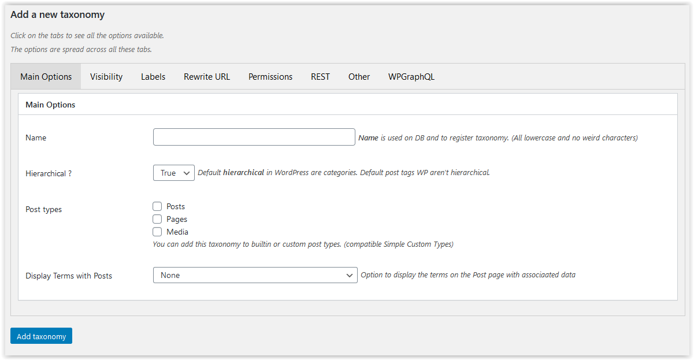

# Add/Modify a Taxonomy

The main purpose of the plug-in is to be able to set the very many parameters available to the user when defining a Taxonomy.

They are all set within this section. This appears in the middle of the initial Settings screen. It also appears as the entire screen for modification.

Because there are so many parameters, the window has been divided into a number of panels rather than supporting a very large page.

The names, in English, associated with the fields correspond to the variables that are being set. There is no point here trying to restate their usage or purpose.

See the [WordPress Documentation](https://developer.wordpress.org/reference/functions/register_taxonomy/) for details of their impact.

You can move from panel to panel reviewing the parameters - but they need to be stored into the database by clicking the Add or Update Taxonomy before they will take effect.

## Main

The name **must** be completed in order to add the taxonomy.

The last fields *Display Terms with Posts* is not related to WordPress standard functionality. It allows you to request that the taxonomy terms are added to posts are displayed with the post content and/or excerpt. When used, the list of terms can be prefixed and suffixed by the user-defined Before and After texts.

## Visibility

This panel contains all the fields that control how the taxonomy is used within WordPress.

## Labels

There are many labels that can be used for a taxonomy, any and all can be changed here.

## Rewrite URL

Enables the taxonomy to be a selection criterion.

## Permissions

Sets the capabilities required to manage the taxonomy. These need to be existing capabilities.

## REST

If non-standard processing is required for REST processing, the code routines can be declared here.

## Other

Various other parameters are managed here.

## WPGraphQL

This is an optional set of parameters and is provided as a convenience to avoid user coding when WPGraphQL is installed.

