# Add/Modify a Taxonomy

**Note. Defining a taxonomy uses the first seven panels. There are an additional four panels used for defining additional uses of the taxonomy. These four panels are available to both custom taxonomies and external ones.**

The main purpose of the plugin is to be able to set the very many parameters available to the user when defining a Taxonomy.

They are all set within this section. This appears in the middle of the initial Settings screen. It also appears as the entire screen for modification.

Because there are so many parameters, the window has been divided into a number of panels rather than supporting a very large page.

The names, in English, associated with the fields correspond to the variables that are being set. There is no point here trying to restate their usage or purpose.

See the [WordPress Documentation](https://developer.wordpress.org/reference/functions/register_taxonomy/) for details of their impact.

You can move from panel to panel reviewing the parameters - but they need to be stored into the database by clicking the Add or Update Taxonomy before they will take effect.

## Custom Main

This will be titled *Add Taxonomy* when adding a taxonomy or *Modify Taxonomy* (with its name) when updating it.
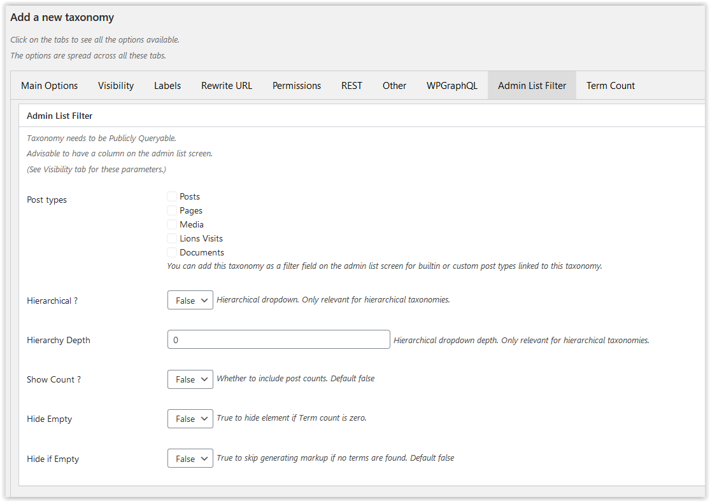

The name **must** be completed in order to add the taxonomy.

The last fields *Display Terms with Posts* is not related to WordPress standard functionality. It allows you to request that the taxonomy terms are added to posts are displayed with the post content and/or excerpt. When used, the list of terms can be prefixed and suffixed by the user-defined Before and After texts.

## External Main

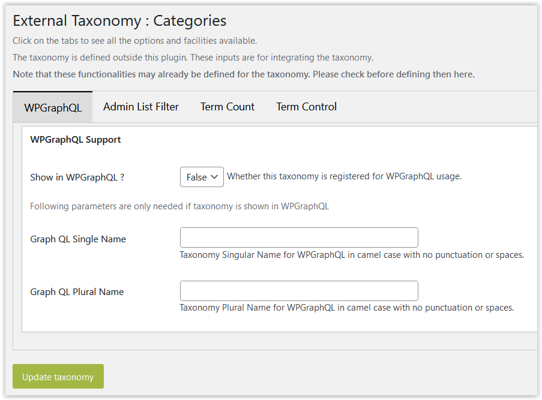

These are optional entries that may be added to an existing taxonomy - and the corresponding element, e.g. WPGraphQL may already be set up. Clearly this should not then be used.

## Visibility

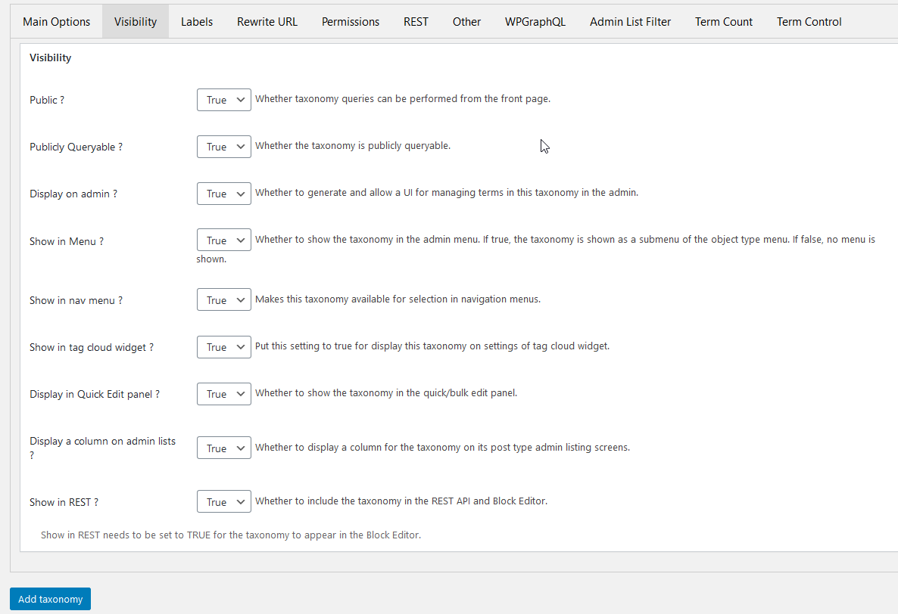

This panel contains all the fields that control how the taxonomy is used within WordPress.

## Labels

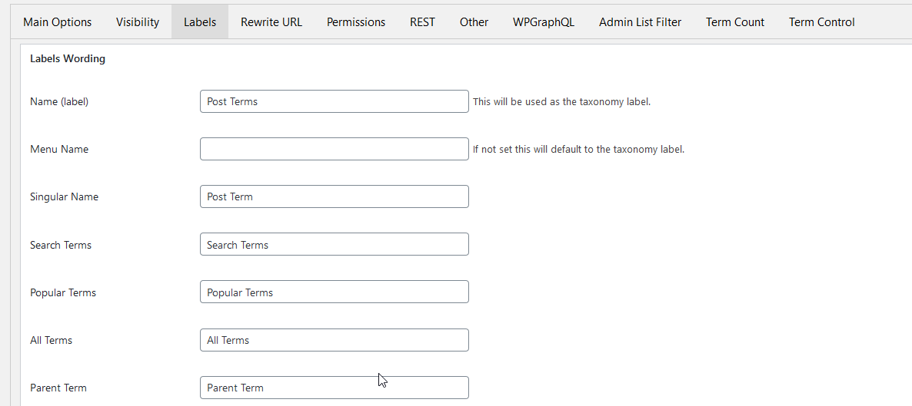

There are many labels that can be used for a taxonomy, any and all can be changed here.

Scroll down using the plugin to see them all. 

## Rewrite URL

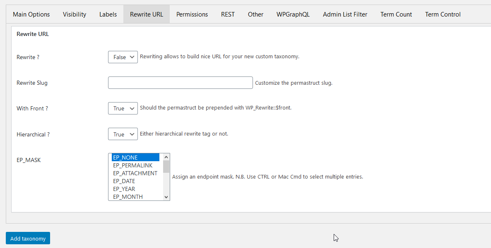

Enables the taxonomy to be a selection criterion.

## Permissions

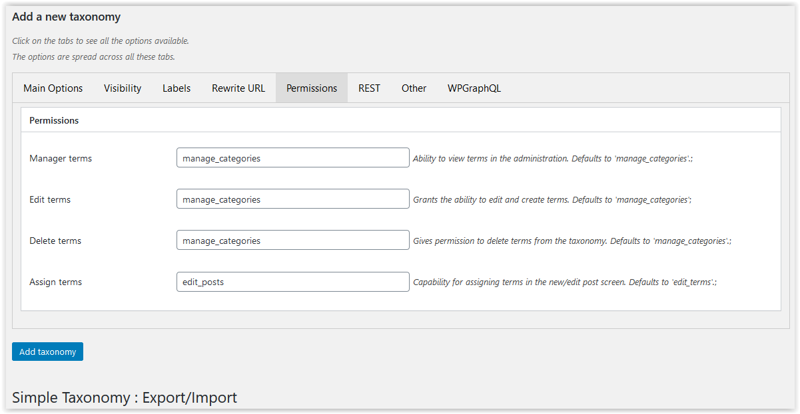

Sets the capabilities required to manage the taxonomy. These need to be existing capabilities.

## REST

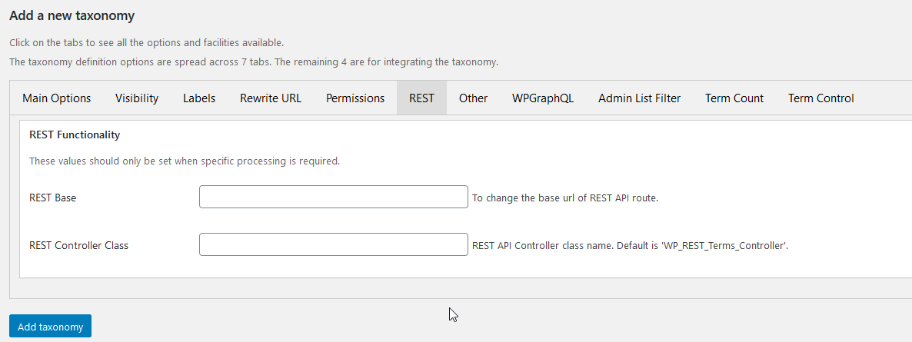

If non-standard processing is required for REST processing, the code routines can be declared here.

## Other

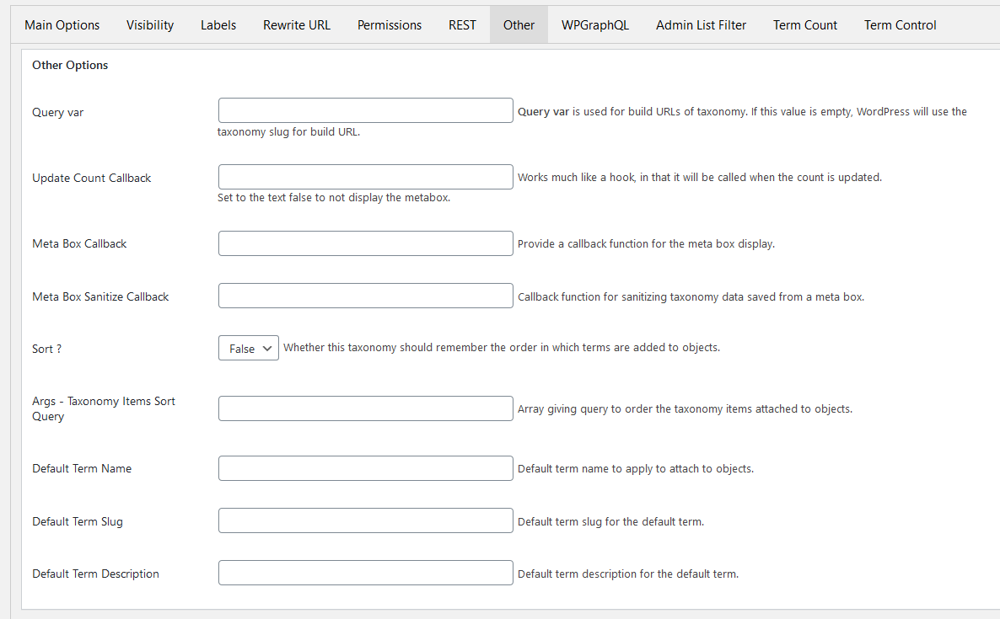

Various other parameters are managed here.

## WPGraphQL

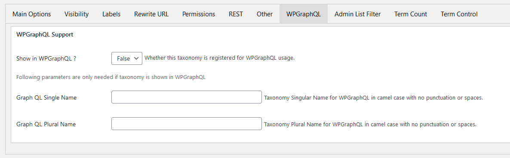

This is an optional set of parameters and is provided as a convenience to avoid user coding when WPGraphQL is installed.

## Admin List Filter

This is an optional set of parameters and allows the user to use the taxonomy as a dropdown filter for selected post types on the admin list screens.

## Term Count

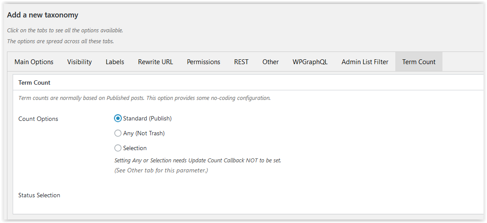

This is an optional set of parameters and allows the user to modify the standard term count of published posts only and to select which post statuses should be included.

Two options are supported - either to count all statuses except trash; and the other allows the statuses to be individually specified.

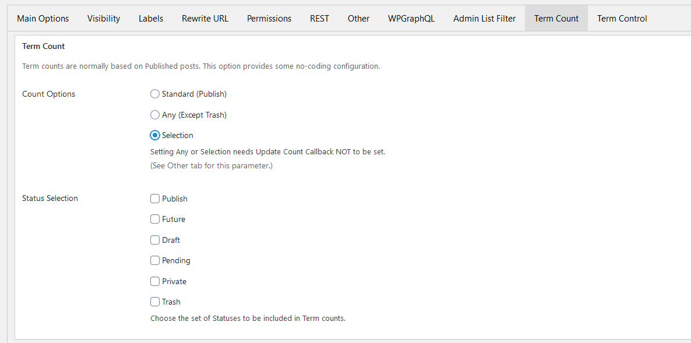

## Term Control

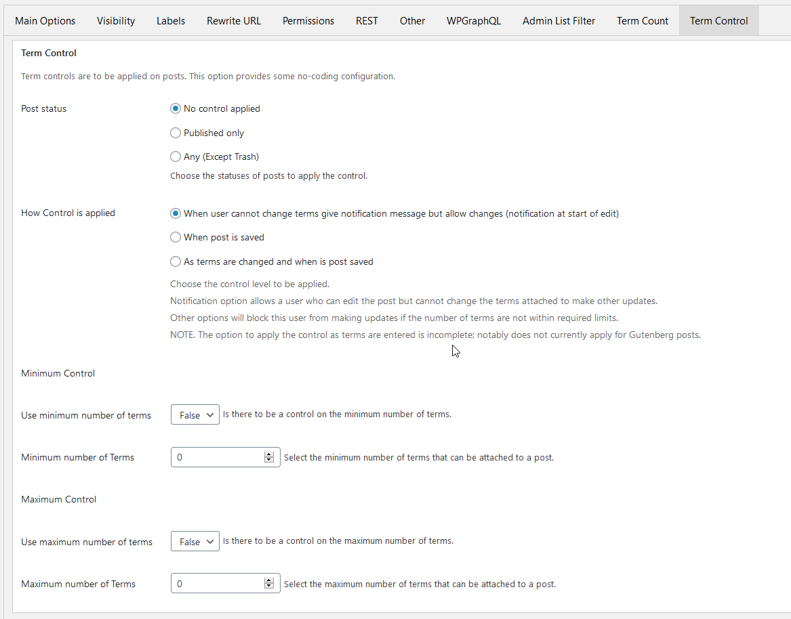

This is an optional set of parameters that allows the user to require a minimum and/or maximum number of terms in the taxonomy to be attached to the post and to select the post statuses when the test is to be applied.

Since a user may be able tro edit the post, but not add or delete terms, this can be notified to the user that the number is outsied the required bounds, but the edit is allowed.

The option "When post is saved" means that the test is done during save post processing - and updates will be rejected if outside the bounds.

The option "As terms are changed and when post is changed" means the bounds are checked during editing as well. This functionality is a "work in progress", that is, not complete. In particular, posts edited with the Block Editor are not currently controlled except when saving the post.

