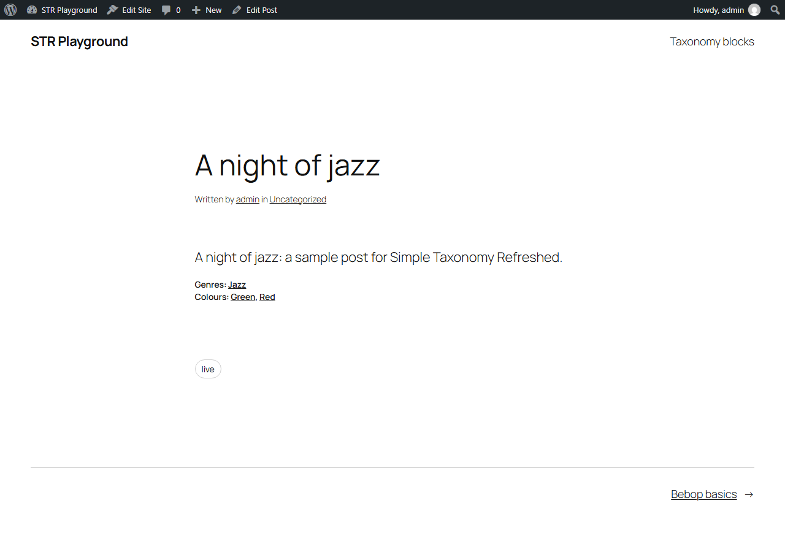
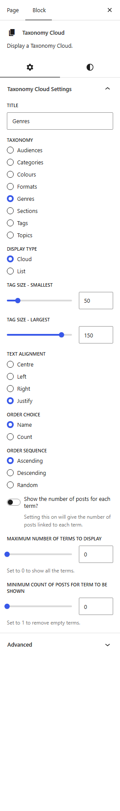
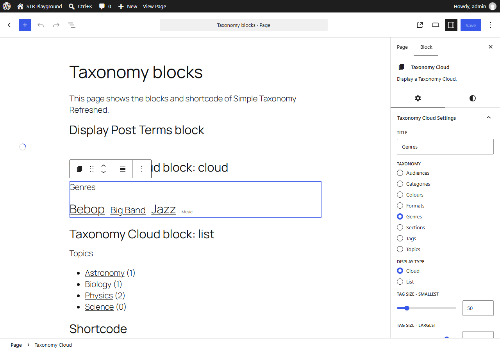
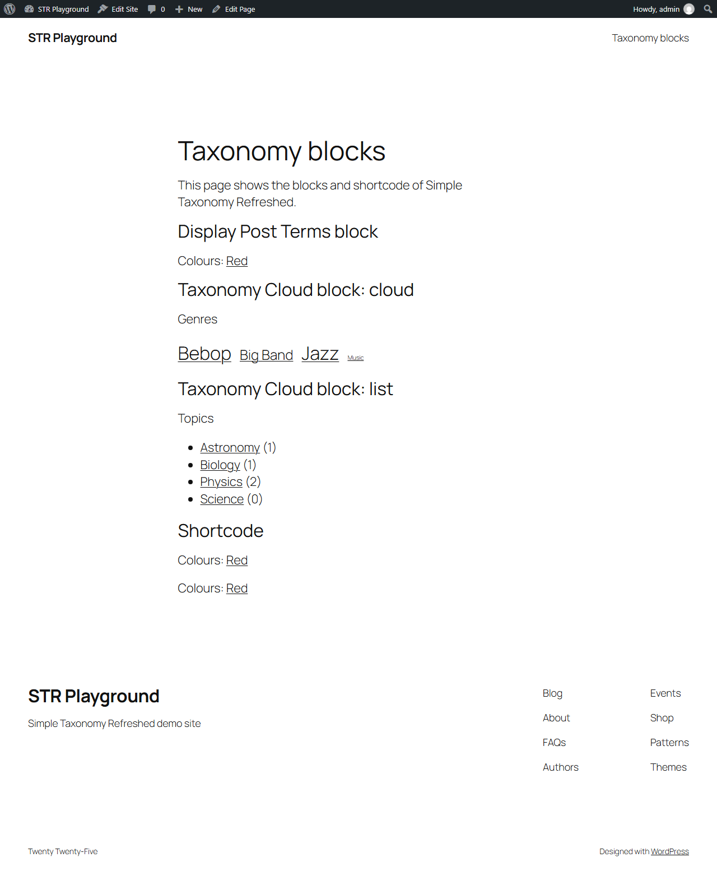

# Showing terms on the site

The plugin has several ways to show terms to visitors:

- the terms of a post, added after its content or excerpt;
- the `[staxo_post_terms]` shortcode;
- the **Display Post Terms** block;
- the **Taxonomy Cloud** block and the **Simple Taxonomy Widget**, which show all the terms of a taxonomy as a cloud or a list.

The first three only apply to taxonomies defined by the plugin. The cloud and the widget can show any public taxonomy. The examples are from the [demo site](example.md).

## Terms after the post content

On a taxonomy's [Main Options](taxonomies.md#main-options) tab, **Display Terms with Posts** adds the post's terms after its **Content**, its **Excerpt**, or both. The terms are only added on the post's own page, not on lists of posts. Each term links to its page of posts.

Three texts format the list:

| Setting | Default | Demo's Genres |
| ------- | ------- | ------------- |
| Display Terms Before text | empty | `Genres:` |
| Display Terms Separator text | `, ` (comma and space) | default |
| Display Terms After text | empty | empty |

The texts can be plain text, or HTML such as `<ul><li>`, `</li><li>` and `</li></ul>` to make a list; all three must then be HTML. Plain text is trimmed, with one space added between it and the terms.

In the demo, Genres and Colours are shown after the content of a post:



The terms are inside `<div class="simple-taxonomy">`, with a `<div class="taxonomy-genre wp-block-post-terms">` for each taxonomy, so your theme can style them.

## The shortcode

`[staxo_post_terms]` shows the terms of the current post for every taxonomy defined by the plugin, formatted with each taxonomy's Before, Separator and After texts. Add `tax` with a taxonomy name to show only that taxonomy:

```
[staxo_post_terms tax="colour"]
```

Like the terms after the content, the shortcode only shows terms on the post's own page.

## The Display Post Terms block

The block does the same as the shortcode. In its settings, choose **All Custom** or a single taxonomy. The block has the usual block options for alignment, text and background colours, spacing and typography; your theme's styles apply unless you change them.

The block can be placed in a post, or in the Single Posts template of a block theme to show the terms on every post.

## The Taxonomy Cloud block

The block shows the terms of a taxonomy as a cloud, where the more posts a term has, the larger it is, or as a list. Each term links to its page of posts.



| Setting | Purpose |
| ------- | ------- |
| Title | A heading shown above the terms. |
| Taxonomy | The taxonomy to show. |
| Display Type | Cloud or List. |
| Tag size - Smallest, Largest | Cloud only: the font size of the terms with the fewest and the most posts, as a percentage of the normal size. |
| Text Alignment | Cloud only: centre, left, right or justify. |
| Order choice | Sort the terms by name or by number of posts. |
| Order sequence | Ascending, descending or random. |
| Show the number of posts for each term? | Adds the count after each term. |
| Maximum number of terms to display | 0 shows all the terms. |
| Minimum count of posts for term to be shown | Set to 1 to leave out terms with no posts. |

The number of posts is the term count, so it follows the taxonomy's [Term Count](taxonomies.md#term-count) setting.

The block also has the usual block options for alignment, colours, spacing and typography.

## The demo page

The demo's **Taxonomy blocks** page has Colours "Red" and contains:

1. the Display Post Terms block, for Colours;
2. the Taxonomy Cloud block for Genres, as a cloud;
3. the Taxonomy Cloud block for Topics, as a list with post counts;
4. the shortcode `[staxo_post_terms tax="colour"]`.

Colours are also set to show after the content of pages, so "Colours: Red" appears a third time at the end.

In the editor:



On the site:



## The Simple Taxonomy Widget

For themes with widget areas (classic themes), **Appearance > Widgets** has the **Simple Taxonomy Widget**. It has the same settings as the Taxonomy Cloud block. In a block theme, use the block instead.

Developers can change the widget's title and its query with the `staxo_widget_title`, `staxo_widget_tag_cloud_args` and `staxo_widget_tag_list_args` [filters](filters.md).
