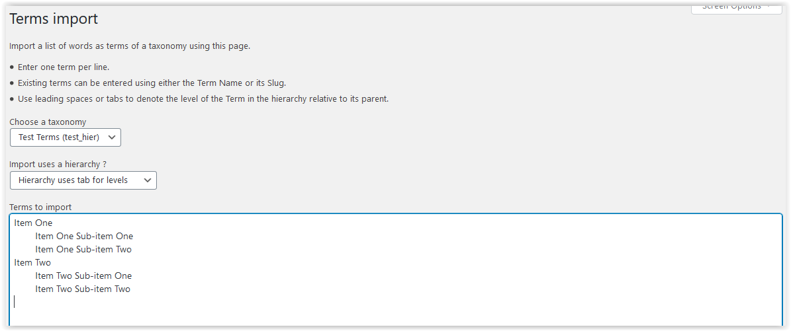
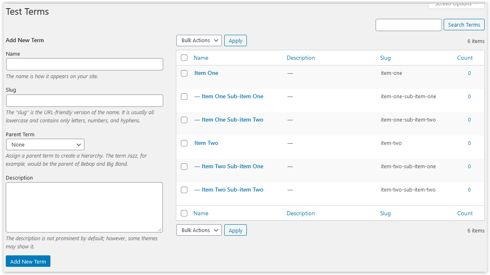
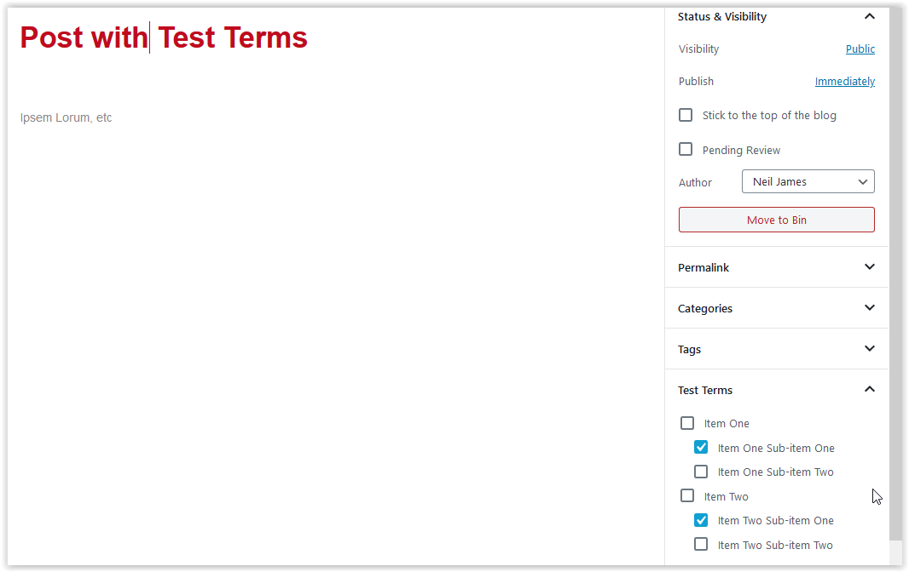
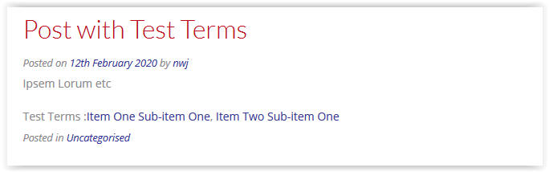

# Add/Modify a Taxonomy

## Creation of a Taxonomy

We will add a taxonomy called test_hier with a few minimal attributes on the various panels:

<u>Main Options</u>
Name: test_hier
Type: Hierarchical
Attached to: Posts
Display terms on: Content

<u>Labels</u>
Name: Test Terms
Menu Name: Test Terms
Singular Name: Test Term

And then added using the *Add Taxonomy* button.

## Display of a Taxonomy

The listing will now contain the Taxonomy:

Clicking on *Export PHP* will download a file call test_hier.php to the browser with the content:

	<?php
	/*
	Plugin Name: XXX - Test Terms
	Version: x.y.z
	Plugin URI: http://www.example.com
	Description: XXX - Taxonomy Test Terms
	Author: XXX - Simple Taxonomy Generator
	Author URI: http://www.example.com
	
	----
	
	Copyright 2019 - XXX-Author
	
	This program is free software; you can redistribute it and/or modify
	it under the terms of the GNU General Public License as published by
	the Free Software Foundation; either version 3 of the License, or
	(at your option) any later version.
	
	This program is distributed in the hope that it will be useful,
	but WITHOUT ANY WARRANTY; without even the implied warranty of
	MERCHANTABILITY or FITNESS FOR A PARTICULAR PURPOSE.  See the
	GNU General Public License for more details.
	
	You should have received a copy of the GNU General Public License
	along with this program; if not, write to the Free Software
	Foundation, Inc., 59 Temple Place, Suite 330, Boston, MA  02111-1307  USA
	*/
	
	add_action( 'init', 'register_staxo_test_hier', 10 );
	
	function register_staxo_test_hier() {
	register_taxonomy( "test_hier", 
	  array (
	  0 => 'post',
	),
	  array (
	  'name' => 'test_hier',
	  'description' => '',
	  'labels' => 
	  array (
	    'name' => 'Test Terms',
	    'menu_name' => 'Test Terms',
	    'singular_name' => 'Test Term',
	    'search_items' => 'Search Terms',
	    'popular_items' => 'Popular Terms',
	    'all_items' => 'All Terms',
	    'parent_item' => 'Parent Term',
	    'parent_item_colon' => 'Parent Term:',
	    'edit_item' => 'Edit Term',
	    'view_item' => 'View Term',
	    'update_item' => 'Update Term',
	    'add_new_item' => 'Add New Term',
	    'new_item_name' => 'New Term Name',
	    'separate_items_with_commas' => 'Separate terms with commas',
	    'add_or_remove_items' => 'Add or remove terms',
	    'choose_from_most_used' => 'Choose from the most used terms',
	    'not_found' => 'No Terms found',
	    'no_terms' => 'No Terms',
	    'items_list_navigation' => 'Terms list navigation',
	    'items_list' => 'Terms list',
	    'most_used' => 'Most Used',
	    'back_to_items' => '← Back to Terms',
	  ),
	  'public' => true,
	  'publicly_queryable' => true,
	  'hierarchical' => true,
	  'show_ui' => true,
	  'show_in_menu' => true,
	  'show_in_nav_menus' => true,
	  'show_tagcloud' => true,
	  'show_in_quick_edit' => true,
	  'show_admin_column' => true,
	  'capabilities' => 
	  array (
	    'manage_terms' => 'manage_categories',
	    'edit_terms' => 'manage_categories',
	    'delete_terms' => 'manage_categories',
	    'assign_terms' => 'edit_posts',
	  ),
	  'rewrite' => false,
	  'query_var' => 'test_hier',
	  'show_in_rest' => true,
	  'rest_base' => '',
	  'rest_controller_class' => '',
	  'sort' => false,
	) );
	}
	// Display Terms with Posts: content.

This can be included in your own code - but then should be deleted as a custom taxonomy.

You can also use it as a single page reference, which is why the last line comment has been added.

## Adding Terms to the taxonomy
Since show_in_menu is set to true, it is available as a sub-menu from the Posts menu.

However, we'll add some via the [Terms Import](./TermImp.md) functionality.

Enter the four terms for the taxonomy using leading tabs to denote the levels:

Once the Import these words as Terms button have been pressed, we can see them in the Terms screen.

## Using the Taxonomy in the Post

Now create a post using the block editor with some Terms added:

When viewing the Post, we can see the terms that have been added:

