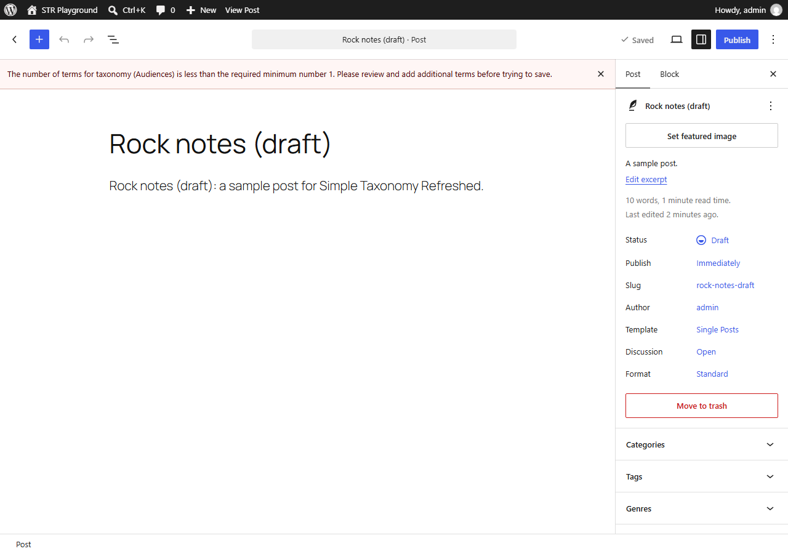
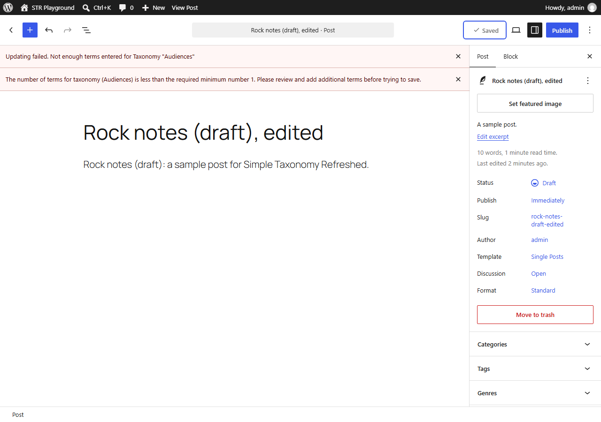
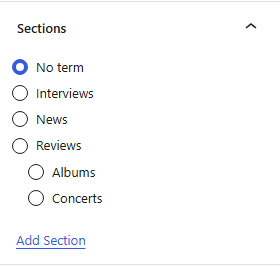
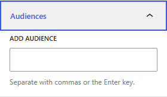
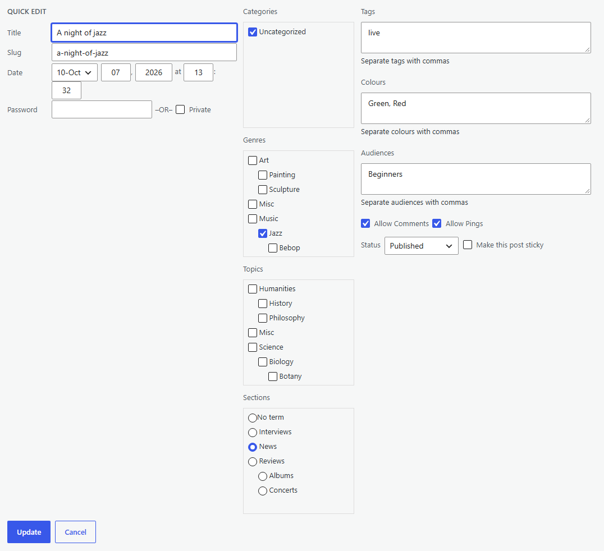
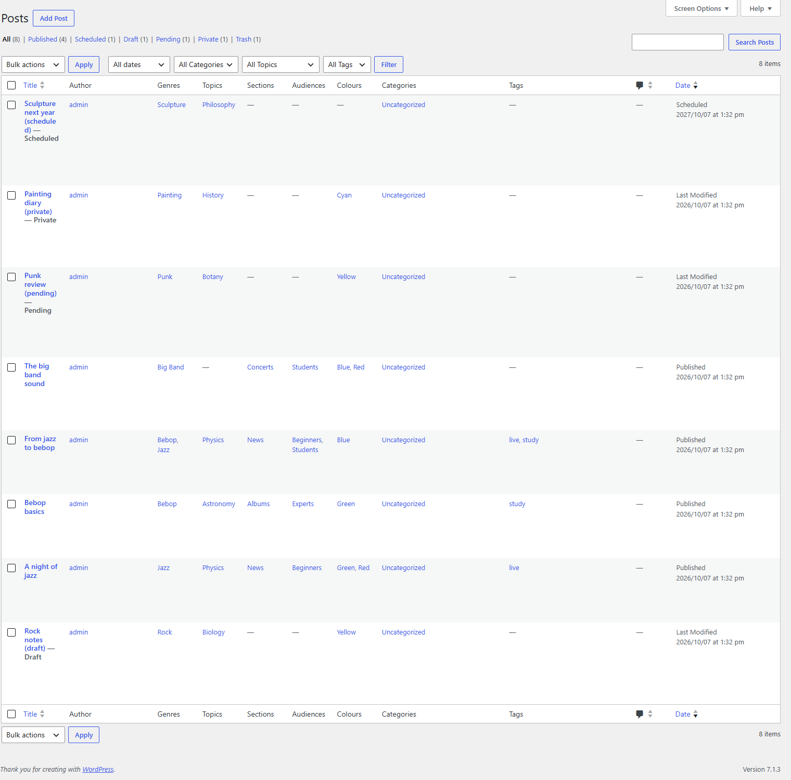
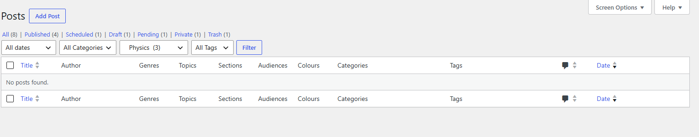
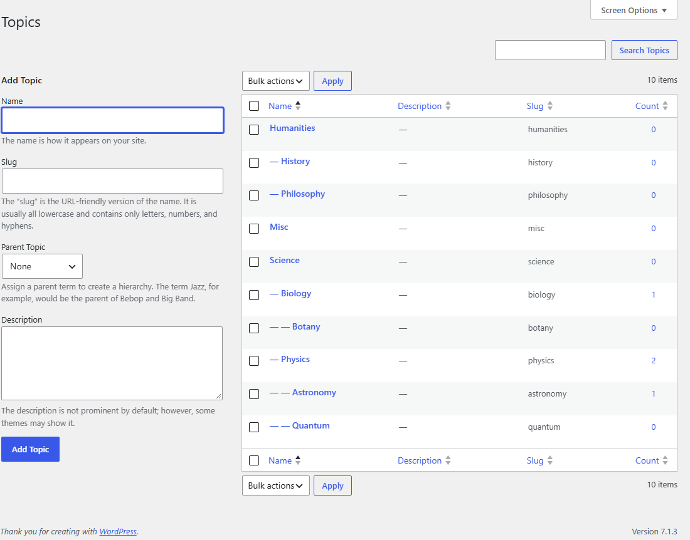

# Editing posts

This page describes what the plugin changes when posts are edited: the term limits set on a taxonomy's **Term Control** tab, the radio buttons for one-term taxonomies, and the admin post lists. The examples are from the [demo site](example.md).

## Term limits

A taxonomy's [Term Control](taxonomies.md#term-control) tab can require a minimum and a maximum number of terms on each post. The limits are checked everywhere a post can be saved: the block editor, the classic editor, Quick Edit and the REST API.

The settings decide:

- **which posts are checked**: all posts except those in the trash, or only published and scheduled posts (a draft can then be saved with any number of terms, but cannot be published until its terms are within the limits);
- **which post types are checked**;
- **how the limits are applied**: by notice only, when the post is saved, or also as the terms are changed.

In the demo, every post needs 1 or 2 Audiences, checked when it is saved.

### Opening a post outside the limits

When a post is opened in the editor and its terms are already outside the limits, a notice says so. The draft "Rock notes" has no Audience:

The notice asks the user to add or remove terms before saving. If the user cannot assign terms of that taxonomy, the notice says so too, and warns that they will not be able to save their changes.

### Saving

With **When the post is saved**, a post outside the limits is not saved:

- **Block editor**: the save is refused with the message *Not enough terms entered for Taxonomy "Audiences"* (or *Too many terms entered*). The post stays open, with your changes, so you can correct the terms and save again.

  

- **Classic editor**: the post screen opens again with a notice giving the number of terms required. The changes are not saved.
- **Quick Edit**: the message is shown in the Quick Edit row.
- **REST API**: the request fails with the same message.

With **As terms are changed and when the post is saved**, the block editor also checks the terms each time they change. While they are outside the limits, a notice is shown and the Save and Publish buttons are blocked.

Posts are not checked when they are moved to the trash, or by WordPress's autosave.

### Notification only

With **When user cannot change terms give notification message but allow changes**, the limits are never enforced. This suits a site where some users, such as contributors, may edit posts but not assign terms of the taxonomy: when they open a post outside the limits they are told so, and they can still save their other changes. Users who can assign the terms see no message.

The demo's Sections use this setting.

## Radio buttons

When a hierarchical taxonomy's maximum is 1, its checkboxes are replaced by radio buttons, so only one term can be chosen. This happens in the block editor, the classic editor and Quick Edit, whichever way the limit is applied.

When there is no minimum, a **No term** choice is added (its text is the taxonomy's *No term* label). When the minimum is 1, there is no such choice: one term must be chosen.

In the block editor, the demo's Sections panel has radio buttons:

Its Audiences panel, a flat taxonomy, has WordPress's usual tag field:

In Quick Edit:

A flat taxonomy keeps its tag field even with a maximum of 1; the limit is then checked when the post is saved. If a post already has more than one term of the taxonomy when it is opened, the checkboxes are kept, so that the extra terms can be removed.

## The admin post lists

### Columns

A taxonomy has a column on the admin list of its post types when **Display a column on admin lists ?** is True on its [Visibility](taxonomies.md#visibility) tab. When a post type has several taxonomies, [Taxonomy List Order](tools.md#taxonomy-list-order) sets the order of their columns. The demo shows them in the order Genres, Topics, Sections, Audiences, Colours, Categories, Tags.

### Filters

A taxonomy's [Admin List Filter](taxonomies.md#admin-list-filter) tab adds a drop-down list of its terms above the list. Choose a term and click **Filter** to list only its posts. In the demo, Topics and Tags have filters. Here the list is filtered on the Topic Physics:

### Term counts

The count of posts for each term is shown on the taxonomy's terms screen (for example **Posts > Topics**), in the admin filter when **Show Count ?** is set, and in the Taxonomy Cloud block. A taxonomy's [Term Count](taxonomies.md#term-count) tab chooses the post statuses counted. The demo's Topics count published and draft posts:

