# Taxonomies

A taxonomy is a way of grouping posts. WordPress has two of its own: Categories, which are hierarchical, and Tags, which are flat. Each group in a taxonomy is a *term*: "Jazz" is a term of the demo's Genres taxonomy.

This page covers the plugin's settings screens. The examples are from the [demo site](example.md).

## The Taxonomies menu

When the plugin is active, the admin menu has a **Taxonomies** item:

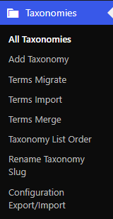

| Menu item | Purpose |
| --------- | ------- |
| All Taxonomies | Lists the taxonomies defined by the plugin and the other taxonomies of the site (this page). |
| Add Taxonomy | Defines a new taxonomy (this page). |
| Terms Migrate, Terms Import, Terms Merge | Tools for terms (see [Tools](tools.md)). |
| Taxonomy List Order | Orders the taxonomy columns of the admin post lists. Shown when a post type has more than one taxonomy. |
| Rename Taxonomy Slug | Renames a taxonomy defined by the plugin. Shown once the plugin defines a taxonomy. |
| Configuration Export/Import | Saves or loads all the plugin's settings. |

The screens need the `manage_options` capability, which administrators have.

## All Taxonomies

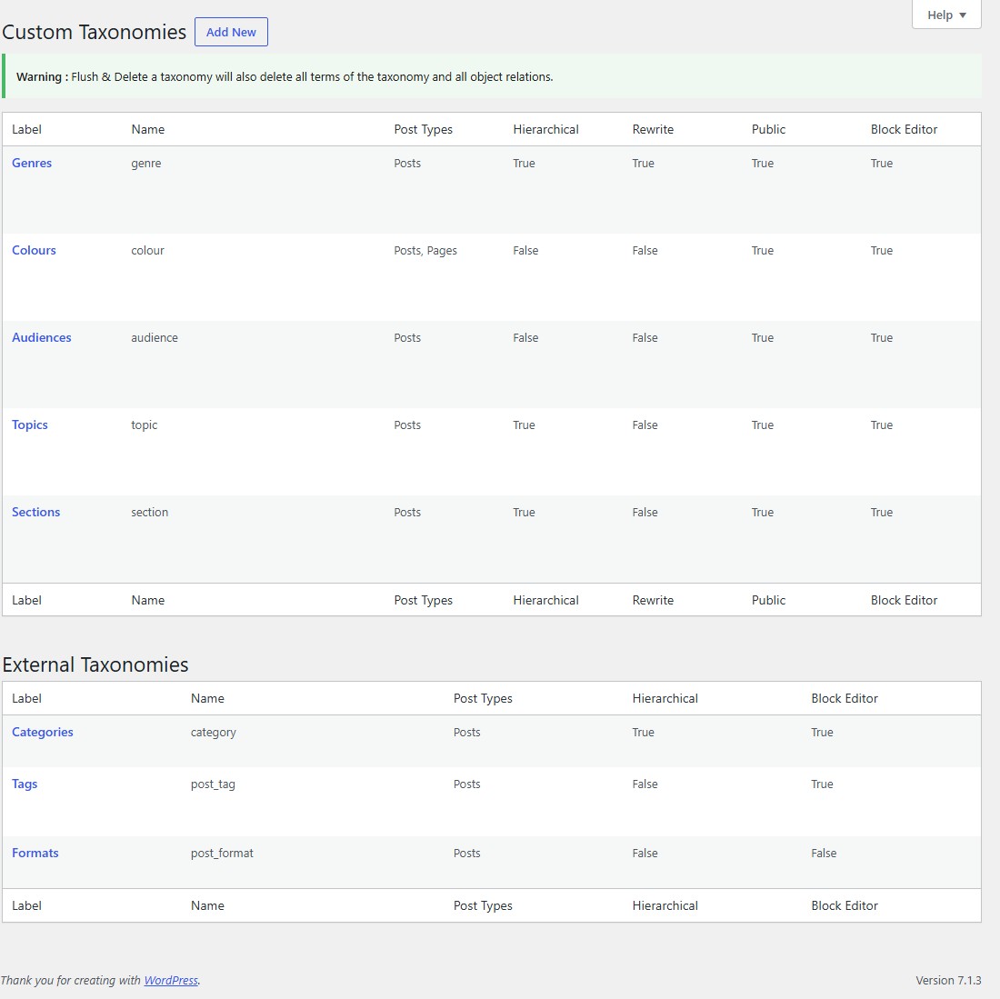

The screen has two lists.

**Custom Taxonomies** are the taxonomies defined by the plugin, with their main settings. Hover over a taxonomy to see its actions:

| Action | What it does |
| ------ | ------------ |
| Modify | Opens the taxonomy's settings (see [Adding or changing a taxonomy](#adding-or-changing-a-taxonomy)). |
| Export PHP | Downloads PHP code that registers the taxonomy with the same settings (see [Export PHP](#export-php)). |
| Delete | Deletes the taxonomy's definition. Its terms stay in the database, but cannot be seen until a taxonomy with the same name is defined again. |
| Flush & Delete | Deletes the definition, all the taxonomy's terms, and their links to posts. This cannot be undone. |

**External Taxonomies** are the other public taxonomies of the site: WordPress's Categories and Tags, and taxonomies from your theme or other plugins. Their action is **Extra Functions** (see [Extra functions for existing taxonomies](#extra-functions-for-existing-taxonomies)). Once extra functions are set, **Delete Extra Functions** removes them; it does not change the taxonomy itself.

## Adding or changing a taxonomy

Use **Taxonomies > Add Taxonomy**, or **Add New** on the All Taxonomies screen, to define a taxonomy. **Modify** opens the same form for an existing one.

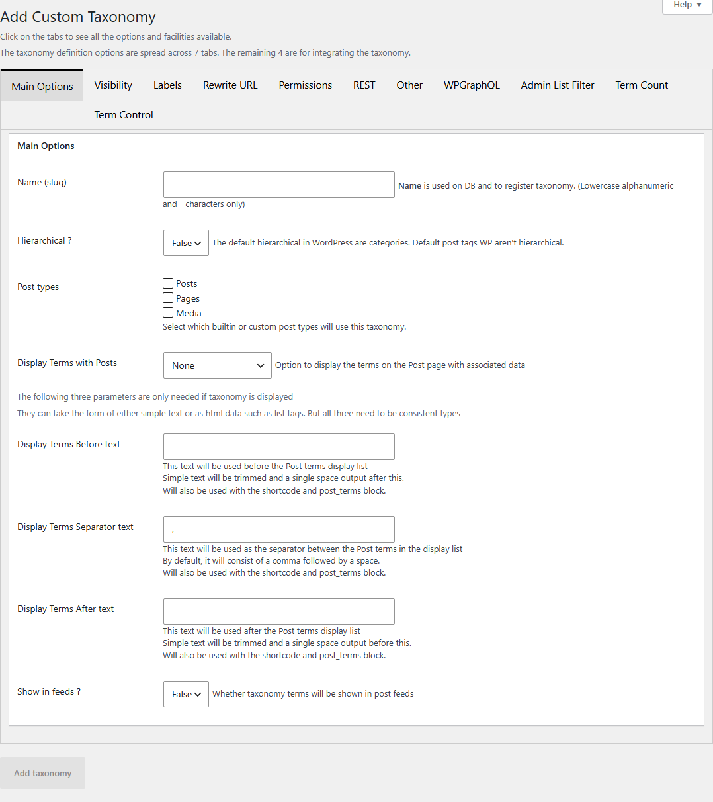

The form has eleven tabs. The first seven hold the settings of the taxonomy itself, which WordPress uses when it registers the taxonomy. The last four add the plugin's own functions. Nothing is saved until you click **Add taxonomy** or **Update taxonomy**, so you can move between the tabs freely.

Only a few settings are needed. To start, enter on the Main Options tab the **Name (slug)**, whether the taxonomy is **Hierarchical**, and the **Post types** that use it; then the **Name (label)** on the Labels tab. Everything else has a sensible default.

Most fields match a parameter of WordPress's [`register_taxonomy()`](https://developer.wordpress.org/reference/functions/register_taxonomy/) function, whose documentation describes them in detail. The sections below explain the fields that need it, with the settings of the demo's Genres taxonomy.

### Main Options

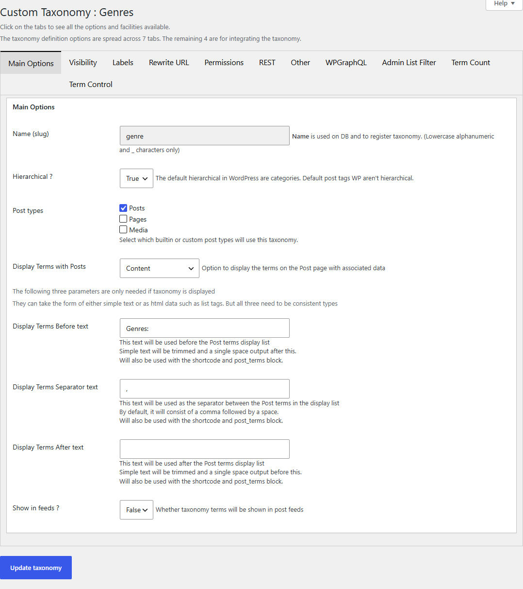

- **Name (slug)** identifies the taxonomy in the database and in code: lowercase letters, numbers and underscores, up to 32 characters. It cannot be changed on this form once the taxonomy is added; use [Rename Taxonomy Slug](tools.md#rename-taxonomy-slug) instead. The name cannot be one that posts already use in the REST API, such as `format`, `status`, `type` or `author` (see [REST](#rest)).
- **Hierarchical ?** True gives terms with parents and children, like Categories; False gives flat terms, like Tags.
- **Post types** are the post types that use the taxonomy.
- **Display Terms with Posts** adds the post's terms after its content, its excerpt, or both, on the post's own page. **Display Terms Before text**, **Separator text** and **After text** format the list. They are also used by the shortcode and the Display Post Terms block. See [Showing terms on the site](display.md).
- **Show in feeds ?** adds the terms to the site's RSS feeds.

Genres is hierarchical, used by Posts, and shown after the content with "Genres:" before the terms.

### Visibility

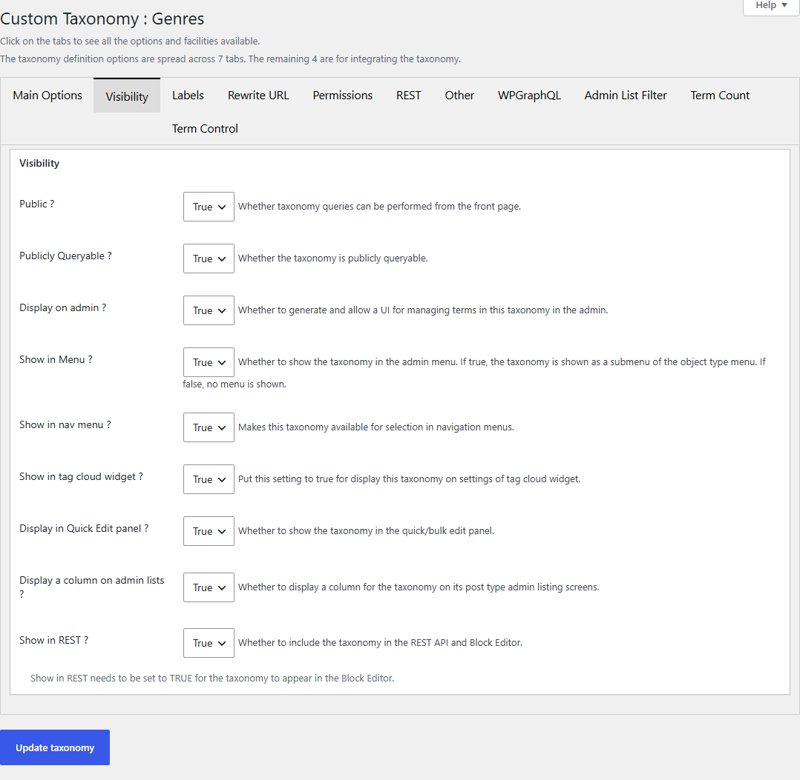

These settings decide where the taxonomy can be seen and used: on the site (**Public ?**, **Publicly Queryable ?**), in the admin (**Display on admin ?**, **Show in Menu ?**, **Display in Quick Edit panel ?**, **Display a column on admin lists ?**), in navigation menus and the Tag Cloud widget, and in the REST API.

**Show in REST ?** must be True for the taxonomy to appear in the block editor.

### Labels

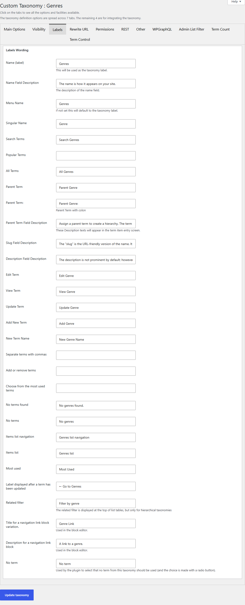

The texts WordPress shows for the taxonomy: its name in menus, the titles and buttons of its terms screen, and the texts of its panel in the editor. Only **Name (label)** is needed; the others default to WordPress's texts for categories (hierarchical) or tags (flat).

The defaults shown on a new taxonomy are those for a hierarchical one. For a flat taxonomy, set Hierarchical to False, add the taxonomy, then open it again with Modify: the labels then show the texts for tags, which you can change as needed.

**No term** is a label added by the plugin. It is the choice shown with the radio buttons when a post may have no term (see [Editing posts](post-editing.md#radio-buttons)).

### Rewrite URL

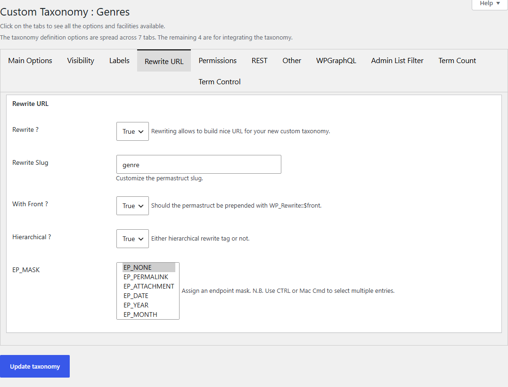

With **Rewrite ?** True, each term has a readable URL that lists its posts. **Rewrite Slug** is the first part of that URL (the taxonomy name by default). With the hierarchical option, the URL includes the term's parents. Genres uses the slug `genre`, so the posts of Jazz are at `/genre/music/jazz/`.

The site's permalinks must be set to something other than Plain (**Settings > Permalinks**) for these URLs to work.

### Permissions

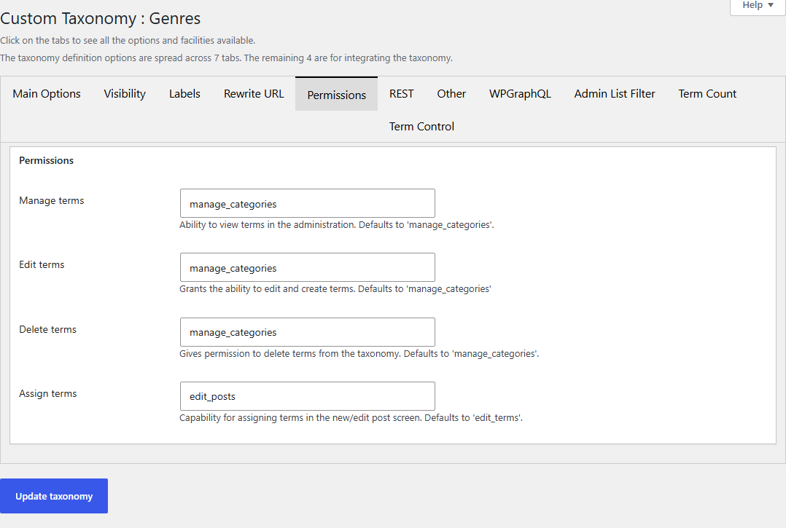

The capabilities needed to manage, edit, delete and assign the terms. Leave them empty to use WordPress's defaults. A capability entered here must exist, for example one added by a role editor plugin.

### REST

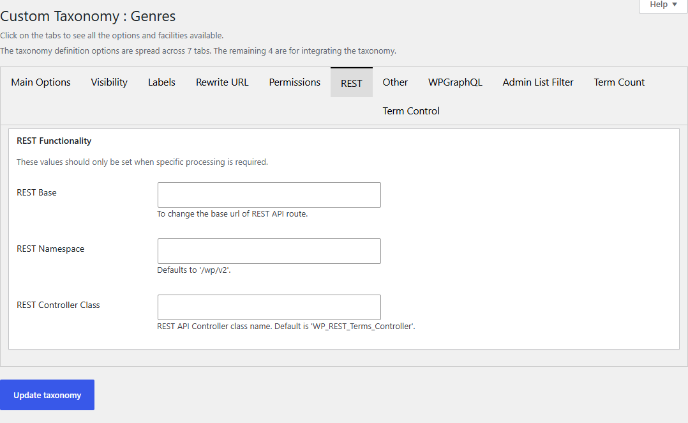

Only needed for special cases. **REST Base** changes the taxonomy's address in the REST API: the demo's Colours use `colours`, so they are at `/wp-json/wp/v2/colours`.

The REST Base (or the name, when it is empty) is also the field that holds the taxonomy's terms in a post's REST data, which the block editor uses. So it must not be a field that posts already have, such as `format` (the post format), `status`, `type`, `author` or `title`, nor a field added by another plugin, nor another taxonomy's REST Base (such as `categories` or `tags`). WordPress would leave the taxonomy out of the post's REST data, and the block editor could not set its terms. The plugin refuses to save such a taxonomy. To use a name such as `format`, enter a different REST Base, such as `formats`.

### Other

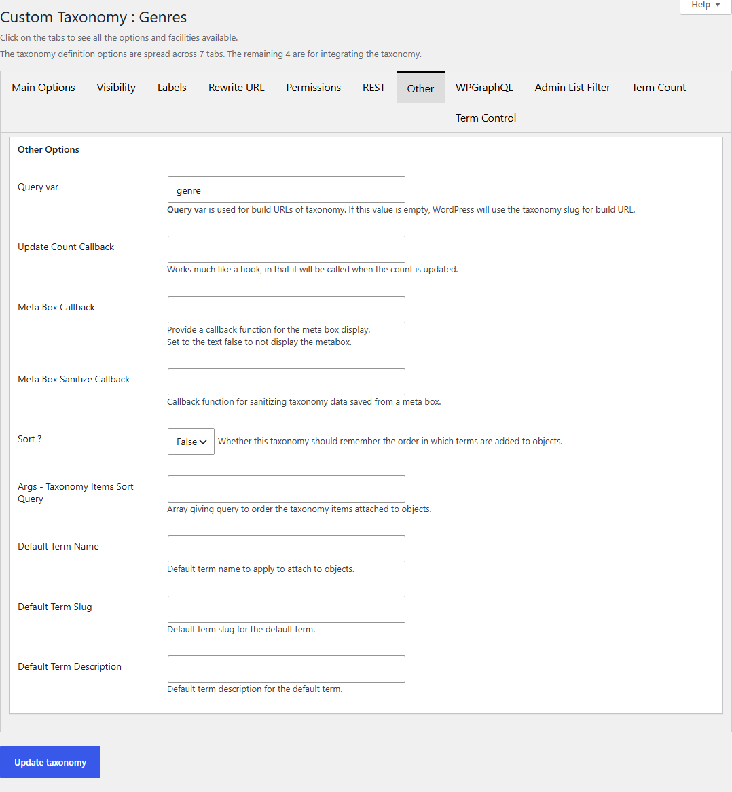

- **Query var** is the name used for the taxonomy in URLs such as `?genre=jazz`. It defaults to the taxonomy name.
- **Sort ?** keeps the terms of a post in the order they were added.
- **Default Term Name**, **Slug** and **Description** create a term that WordPress gives to a post saved without any term of the taxonomy. The demo's Colours have the default term "Unsorted".
- **Update Count Callback**, **Meta Box Callback** and **Meta Box Sanitize Callback** name PHP functions of your own. Because WordPress runs these functions, only users with the `unfiltered_html` capability can change them (on a multisite network, super admins). The `staxo_can_edit_callbacks` [filter](filters.md) changes this.

### WPGraphQL

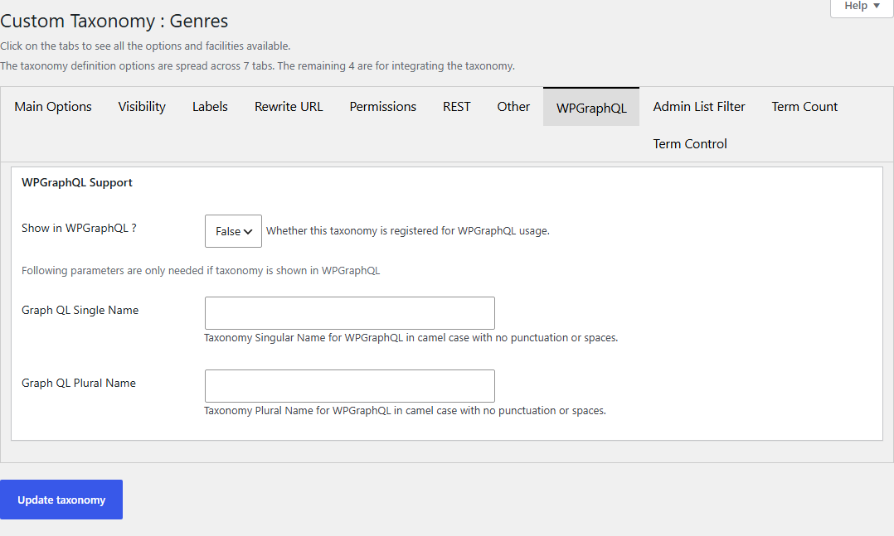

For sites using the [WPGraphQL](https://www.wpgraphql.com/) plugin. **Show in WPGraphQL ?** adds the taxonomy to the GraphQL schema, with the singular and plural names given here (in camel case, such as `genre` and `genres`).

### Admin List Filter

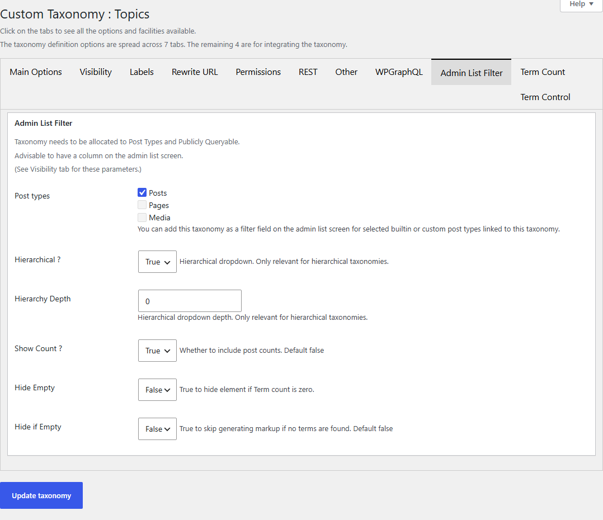

Adds a drop-down list of the taxonomy's terms above the admin list of the chosen post types, to show only the posts with a term. The taxonomy must be used by those post types and be Publicly Queryable. A column for the taxonomy on the list (Visibility tab) is advisable.

- **Hierarchical ?** and **Hierarchy Depth** show the terms indented under their parents, to the depth given (0 for all levels).
- **Show Count ?** shows the number of posts after each term.
- **Hide Empty** leaves out terms with no posts; **Hide if Empty** leaves out the whole list when there are no terms.

The demo's Topics have a filter on Posts, with the hierarchy and the counts. See [Editing posts](post-editing.md#the-admin-post-lists).

### Term Count

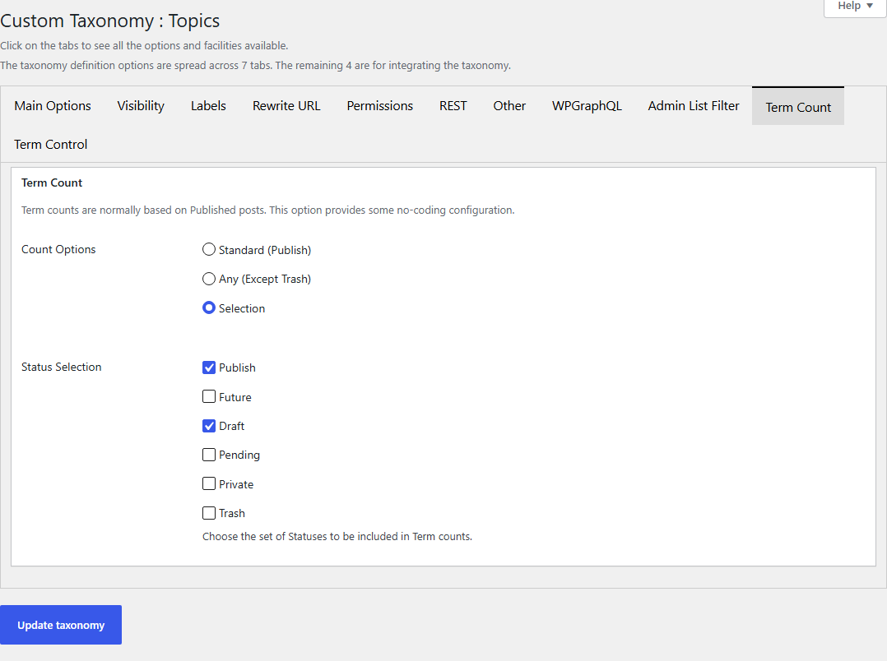

WordPress counts the posts of each term, and shows the count on the terms screen, in clouds and in the admin filter. Normally only published posts count. This tab changes that:

- **Standard (Publish)**: published posts only.
- **Any (Except Trash)**: posts of every status except trash.
- **Selection**: the statuses ticked under **Status Selection**.

The demo's Topics count published and draft posts, so Biology counts the draft "Rock notes".

Other statuses, such as those added by other plugins, can be added with the `staxo_term_count_statuses` [filter](filters.md).

### Term Control


Sets the number of terms a post must have. [Editing posts](post-editing.md) describes what users see.

- **Post status**: when the control applies: **No control applied**, **Published only**, or **Any (Except Trash)**.
- **Post types**: the post types to control. None ticked means all the post types of the taxonomy.
- **How Control is applied**:
  - **When user cannot change terms give notification message but allow changes**: the limits are only shown, never enforced. A user who cannot assign terms of the taxonomy is told when they open a post outside the limits, and can still save their other changes.
  - **When the post is saved**: a post outside the limits cannot be saved.
  - **As terms are changed and when the post is saved**: as above, and the editor also warns as soon as the terms are outside the limits.
- **Minimum Control** and **Maximum Control**: whether to use a minimum or a maximum, and the number.

The demo's Audiences need 1 or 2 terms on every post that is not in the trash, checked when the post is saved. Its Sections allow at most one term, with notification only:

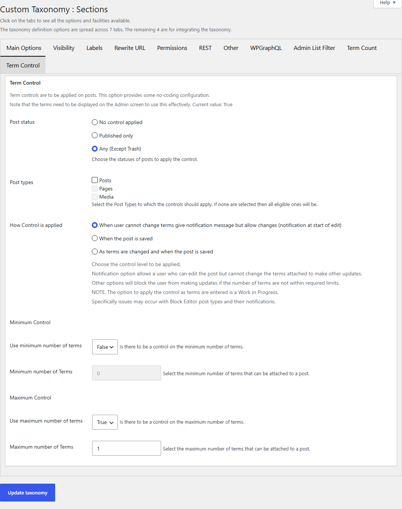

When the maximum is 1, the editors show the terms of a hierarchical taxonomy as radio buttons (see [Editing posts](post-editing.md#radio-buttons)).

## Extra functions for existing taxonomies

Click **Extra Functions** for a taxonomy in the External Taxonomies list to add the plugin's functions to it. The form has the last four tabs only, as the taxonomy itself is defined elsewhere:

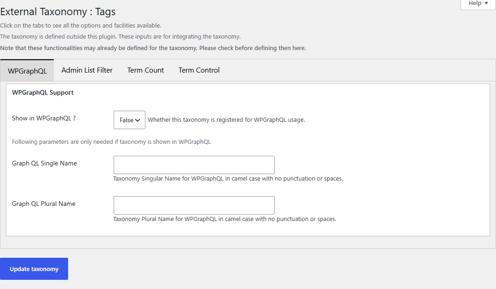

The tabs work as described above. Check first that the function is not already provided: for example, Categories already have an admin filter, and a second one would be added.

In the demo, Tags have an admin list filter with counts, and count every post that is not in the trash:

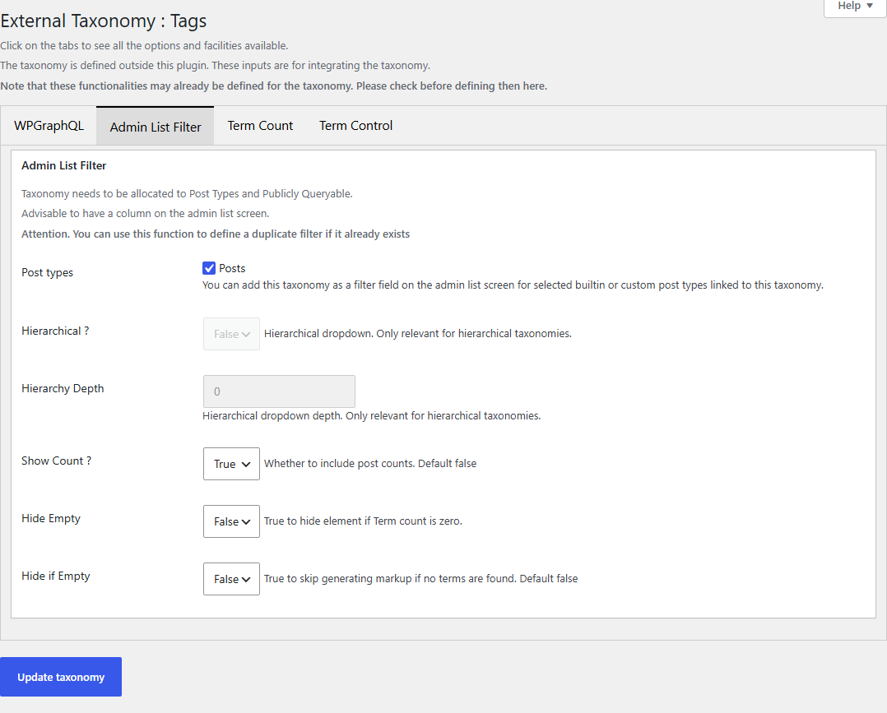

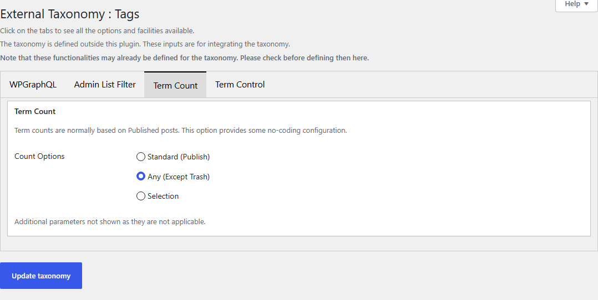

Some taxonomies from other plugins count their terms in their own way. The Term Count tab then warns that counts made with its options may not match, and they are only used if **Use these options to count terms, instead of the taxonomy's own function** is ticked.

## Export PHP

**Export PHP** downloads a PHP file with a `register_taxonomy()` call that has all the taxonomy's settings. Use it to move a taxonomy into your theme or plugin code, so that it no longer depends on this plugin: add the code, then **Delete** the taxonomy here (not Flush & Delete, which would delete its terms).

The file only registers the taxonomy. The settings of the plugin's own functions (term display, admin filter, term counts and term limits) are listed in comments, but no code is generated for them.

The file is a small plugin. For the demo's Genres it looks like this (most labels left out):

```php
<?php
/*
Plugin Name: XXX - Genres
Version: x.y.z
Description: XXX - Taxonomy Genres
Author: XXX - Simple Taxonomy Refreshed Generator
...
*/

add_action( 'init', 'register_staxo_genre', 10 );

function register_staxo_genre() {
register_taxonomy( 'genre', 
  array (
  0 => 'post',
),
  array (
  'name' => 'genre',
  'description' => '',
  'labels' => 
  array (
    'name' => 'Genres',
    'singular_name' => 'Genre',
    ...
    'no_term' => 'No term',
  ),
  'public' => true,
  'publicly_queryable' => true,
  'hierarchical' => true,
  'show_ui' => true,
  'show_in_menu' => true,
  'show_in_nav_menus' => true,
  'show_tagcloud' => true,
  'show_in_quick_edit' => true,
  'show_admin_column' => true,
  'capabilities' => 
  array (
    'manage_terms' => 'manage_categories',
    'edit_terms' => 'manage_categories',
    'delete_terms' => 'manage_categories',
    'assign_terms' => 'edit_posts',
  ),
  'rewrite' => 
  array (
    'slug' => 'genre',
    'with_front' => true,
    'hierarchical' => true,
    'ep_mask' => 0,
  ),
  'query_var' => 'genre',
  'update_count_callback' => '',
  'show_in_rest' => true,
  'sort' => false,
) );
}
// Display Terms with Posts: content
// Display Terms Before text: Genres:
// Display Terms Separator: , 
// Display Terms After text: 
// Show Terms in Feeds: 0
```

Replace the `XXX` and example values in the header with your own before using it.

To copy all the settings to another site that uses this plugin, use [Configuration Export/Import](tools.md#configuration-exportimport) instead.
