# Tools

The **Taxonomies** menu has six tools. Two manage the plugin's settings, and four work on terms:

| Tool | Purpose |
| ---- | ------- |
| [Taxonomy List Order](#taxonomy-list-order) | Orders the taxonomy columns of the admin post lists. |
| [Configuration Export/Import](#configuration-exportimport) | Saves all the plugin's settings to a file, or loads them from one. |
| [Rename Taxonomy Slug](#rename-taxonomy-slug) | Renames a taxonomy defined by the plugin, keeping its terms and their posts. |
| [Terms Import](#terms-import) | Adds a list of terms to a taxonomy. |
| [Terms Migrate](#terms-migrate) | Copies the terms of one taxonomy, ready to import into another. |
| [Terms Merge](#terms-merge) | Merges several terms of a taxonomy into one. |

The term tools work with any public taxonomy, not only those defined by the plugin. They check the user's capabilities for each taxonomy: taxonomies that the user may not change are listed but cannot be chosen. Administrators normally have all the capabilities needed.

WordPress and some hosts cache term data. The tools clear WordPress's own term caches, but other caches may show the old terms for a while.

The examples are from the [demo site](example.md).

## Taxonomy List Order

When a post type has several taxonomies, the admin list of its posts has a column for each, in the order the taxonomies were registered. This tool changes that order.

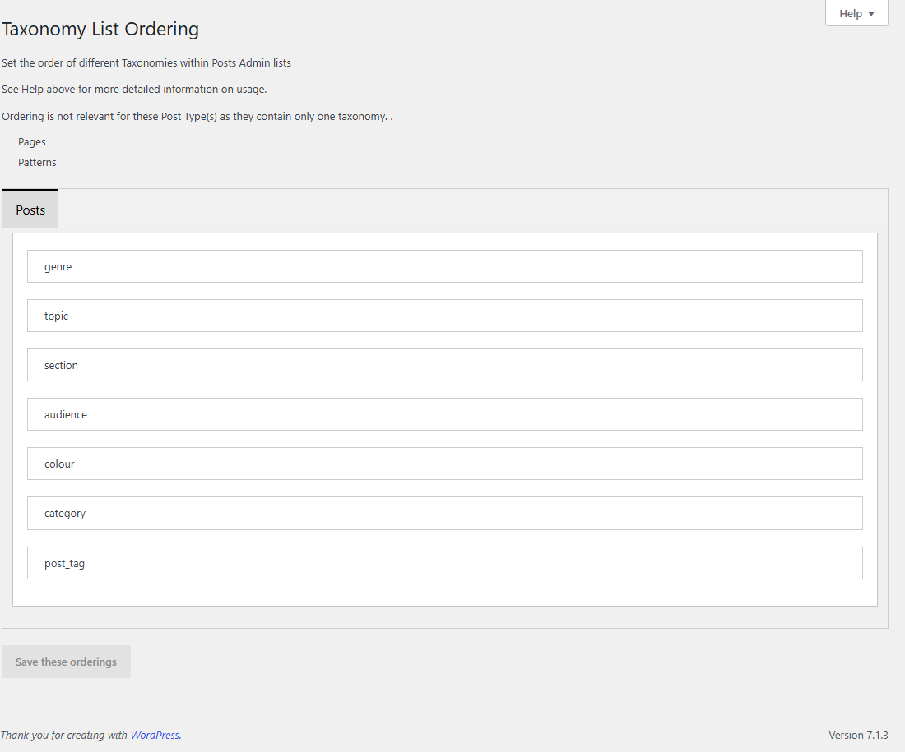

There is a tab for each post type with more than one taxonomy. Drag the taxonomies into the order you want, then click **Save these orderings**. The demo orders the Posts columns as Genres, Topics, Sections, Audiences, Colours, Categories, Tags (see [the Posts list](post-editing.md#the-admin-post-lists)).

Only the order of the taxonomy columns changes: they stay in the same place among the other columns. The menu item is only shown when a post type has more than one taxonomy.

## Configuration Export/Import

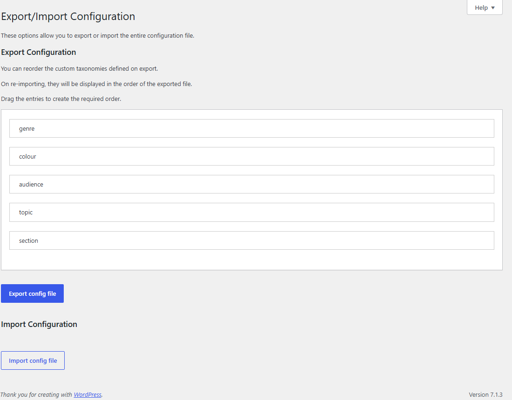

**Export config file** downloads all the plugin's settings as a JSON file: the taxonomies it defines, the extra functions of other taxonomies, and the list orders. Before exporting, you can drag the taxonomies into the order you want them listed after an import.

**Import config file** loads such a file, for example a backup, or the settings of another site:

Choose the file and click the button. The import **replaces** all the current settings, so export them first if you may need them again. Terms and posts are not changed.

The file is checked before it is loaded:

- A taxonomy whose settings are not valid (for example an invalid name or setting, a name already used by WordPress or another plugin, or a [REST name that clashes](taxonomies.md#rest)) is not imported. The others are, and a notice lists the taxonomies left out and why.
- Settings that the plugin does not use are ignored, and a notice gives their number.
- If nothing in the file can be used, nothing is imported and the current settings are kept.

Files exported by versions of the plugin before 4.0 cannot be imported.

## Rename Taxonomy Slug

This tool changes the name (slug) of a taxonomy defined by the plugin. Its terms and their links to posts are moved to the new name. It is only shown once the plugin defines a taxonomy.

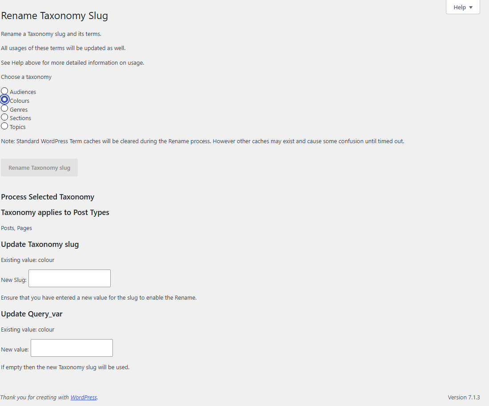

Choose the taxonomy. The screen shows the post types that use it and its current name, query var and, if it uses rewrite, its rewrite slug. Enter the **New Slug**: up to 32 lowercase letters, numbers, dashes and underscores, not used by another taxonomy. If the taxonomy has no REST Base, the new slug must also not [clash in the REST API](taxonomies.md#rest). The query var and rewrite slug can be changed at the same time; an empty query var takes the new name. Then click **Rename Taxonomy slug**.

Code or themes that use the old name must be changed by hand. Links to the taxonomy's old URLs stop working when the rewrite slug changes.

## Terms Import

This tool creates terms in a taxonomy from a list, one term per line. The terms are not linked to any posts.

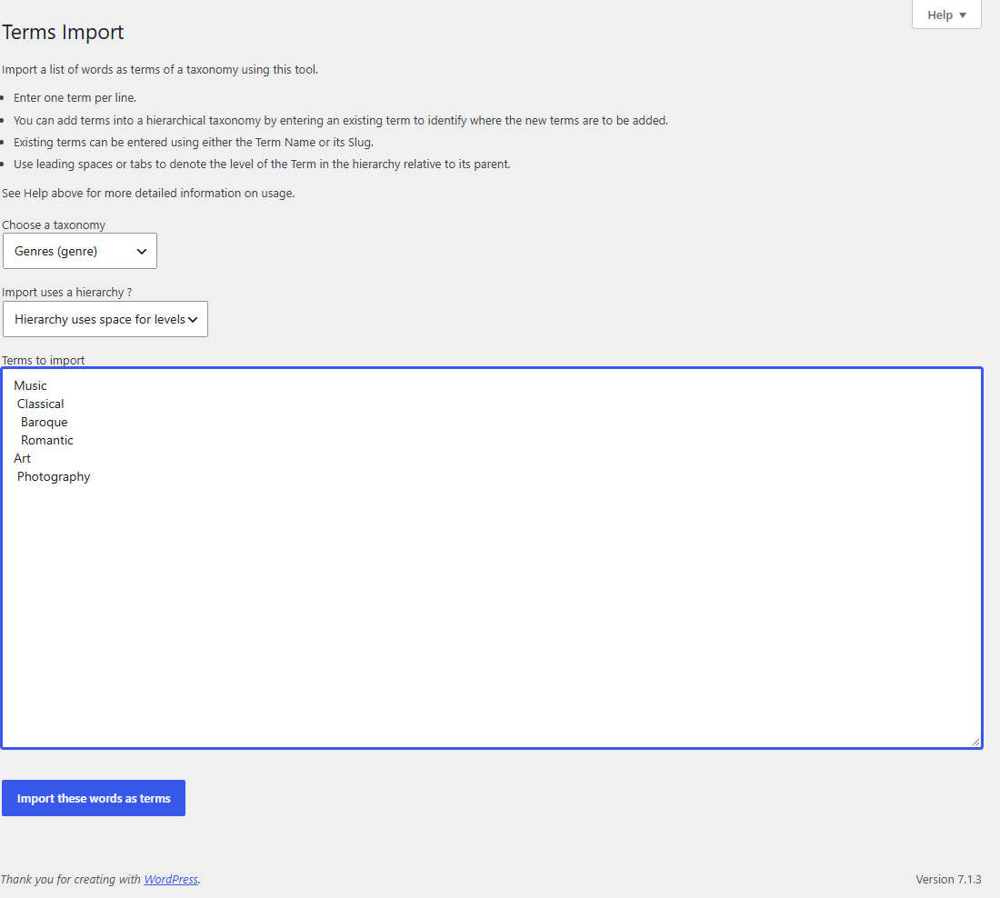

1. Choose the taxonomy.
2. Choose how the list shows the hierarchy:
   - **No hierarchy**: every line is a term at the top level (the only choice for a flat taxonomy).
   - **Hierarchy uses space for levels** or **Hierarchy uses tab for levels**: each extra leading space or tab puts the term one level below the line before it.
3. Enter the terms, and click **Import these words as terms**.

Each term's slug is made from its name, with no description; change them on the taxonomy's terms screen if needed.

A line that names an existing term, by name or by slug, is not created again. Use this to add terms under an existing term: enter that term without an indent, followed by the new terms indented below it. In the example above, Music and Art already exist in the demo's Genres, so the import adds Classical, Baroque and Romantic under Music, and Photography under Art:

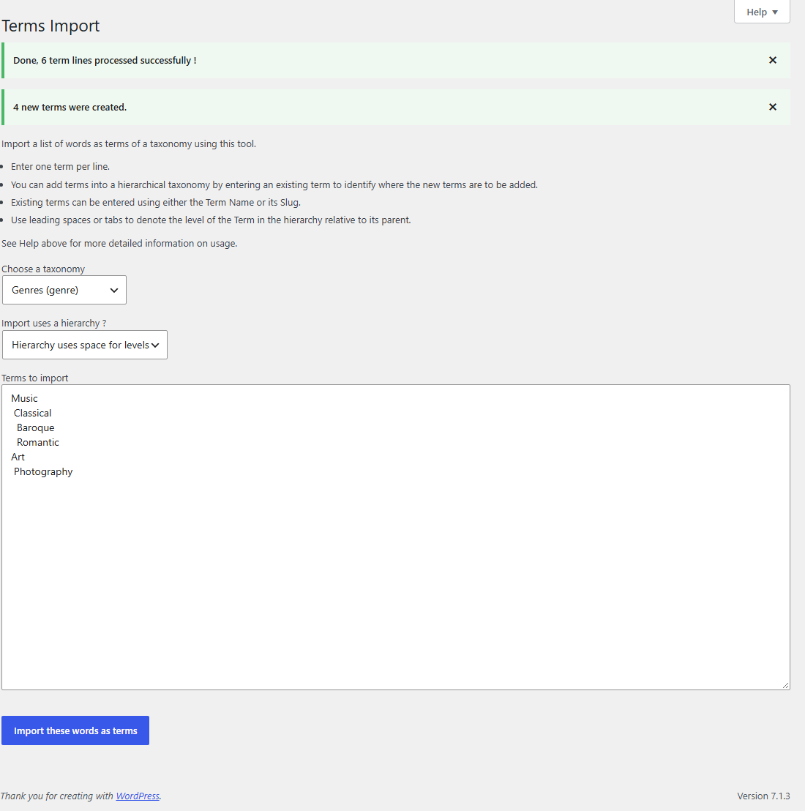

The result gives the number of lines processed and terms created, and lists any line that was skipped, with its line number and the reason.

## Terms Migrate

This tool copies the terms of one taxonomy into another, in two steps. It does not change the existing terms or their posts.

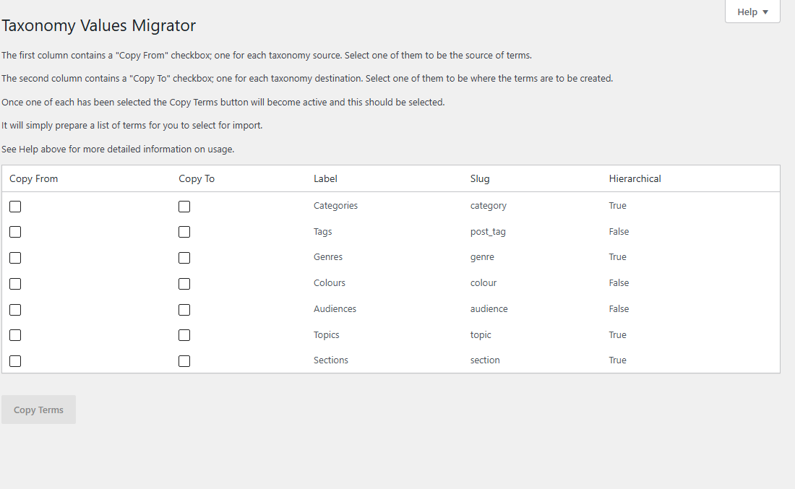

1. Tick **Copy From** on the taxonomy whose terms you want, and **Copy To** on the taxonomy to receive them, then click **Copy Terms**. Here the demo's Genres are copied to Categories:

   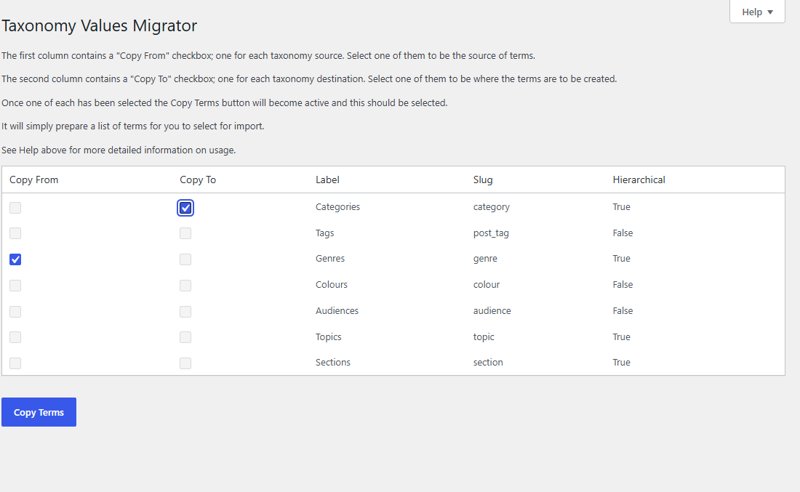

2. A [Terms Import](#terms-import) form is shown, with the list of terms filled in. When both taxonomies are hierarchical, the list keeps the hierarchy; otherwise it is a simple alphabetical list. Edit the list as you wish, then click **Import these words as terms**.

   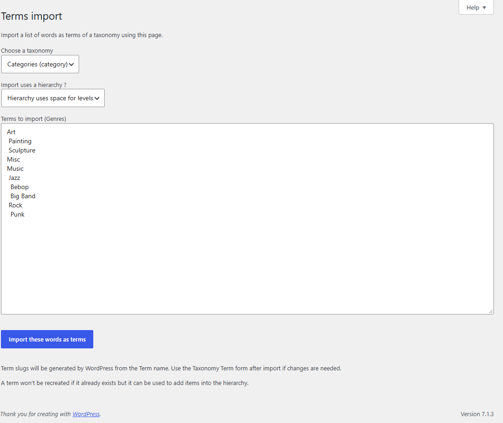

To move the terms rather than copy them, delete them from the first taxonomy afterwards on its terms screen.

## Terms Merge

This tool merges one or more terms of a taxonomy (the *source* terms) into another term (the *destination*). Posts with a source term are given the destination term instead, and the source terms are deleted. It works in steps. Here the demo's Colour Cyan is merged into Blue.

1. Choose the taxonomy and click **Select Taxonomy**.

   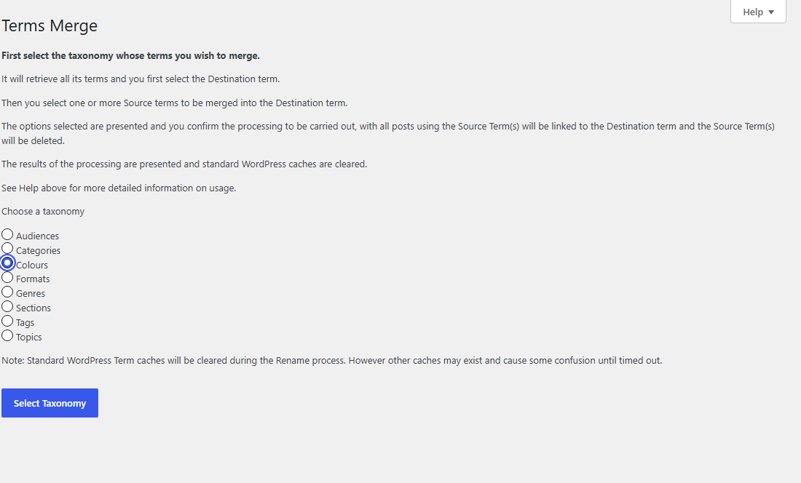

2. Choose the destination term and click **Select Destination Term**.

   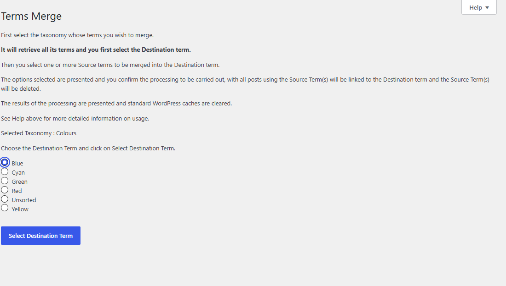

3. Tick the source terms and click **Select Source Term(s)**.

   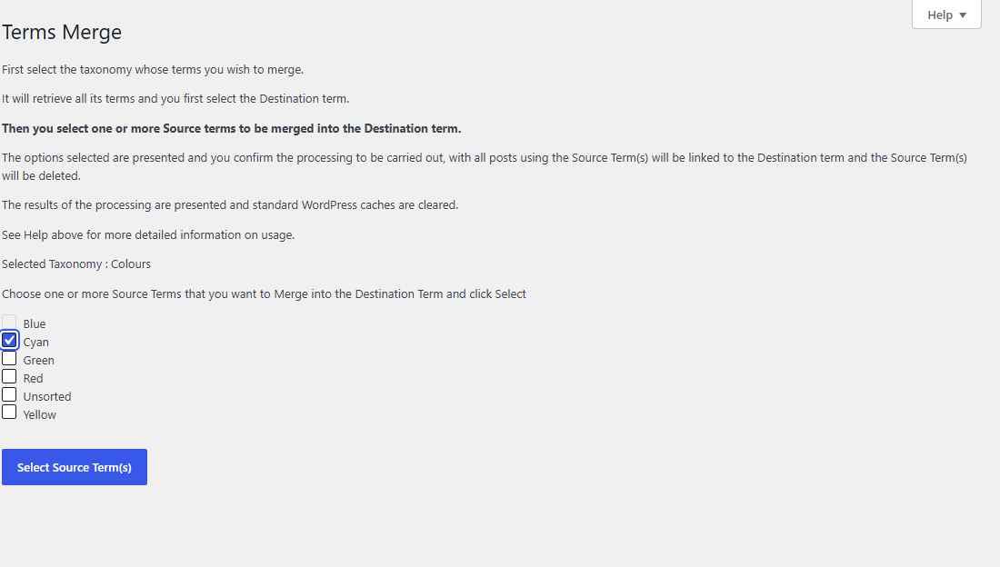

4. Check the summary and click **Confirm Action**.

   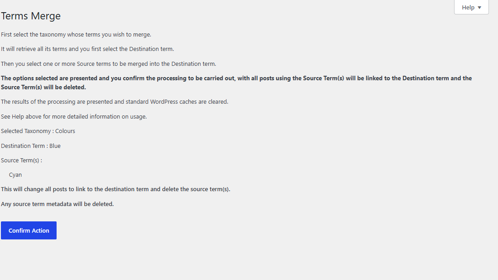

5. The result shows the number of posts changed and the new count of the destination term.

   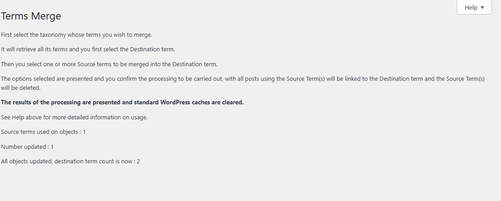

Before you confirm, the summary may ask two more questions:

- **Child terms of the source terms**: move them under the destination term (the default), or up a level, under the source term's parent. If the destination term is itself below a source term, it is first moved up a level.
- **Term Control minimum**: if the taxonomy has a minimum number of terms, the posts that the merge would leave below it are listed (a post with both a source and the destination term loses one term). Choose **Do not merge** (the default) or **Merge anyway**.

The metadata of the source terms is deleted with them.
