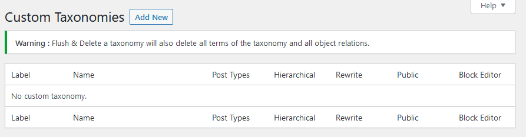
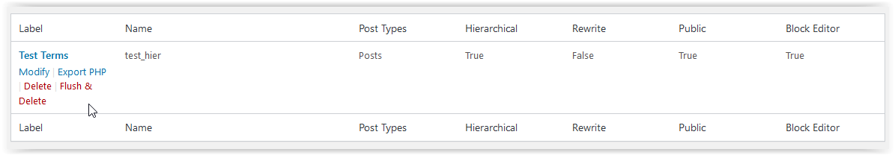
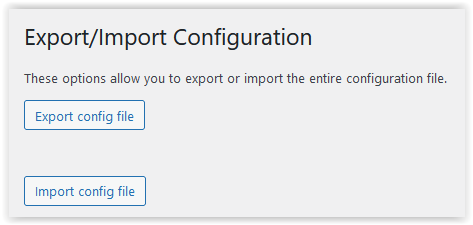

# Use of the Plugin

## Custom Taxonomies Definition

When the plugin is activated, the configuration is available in the administration screen under *Settings* -> *Custom Taxonomies*

The screen has three sections :
* Taxonomy List

This gives a list of the previous entered Custom Taxonomies which is empty when first used.

The taxonomy label name will be used to identify the taxonly used in the plugin screens.

A number of significant properties of each taxonomy is shown in this list.

Once there are some taxonomies, the list will be populated.

Some options will appear in the space under each taxonomy label when the pointer is over the area.

| Option | Processing |
| ---------------- | ----------------------------------------- |
|Modify          | Modify data - in a new panel [Add/Modify Taxonomy](./addmod.md)
|Export PHP      | Creates a download file containing the parameters |
|Delete          | Delete the parameter entries; leaves the term data |
|Flush & Delete  | Deletes the parameter entries and the term data |

See the [example page](./example.md) for an example download file.

* Add a new taxonomy

This part of the form is available to add a new Custom Taxonomy at any time. It contains default values for the taxonomies.

When modifying an existing taxonomy a panel with only this section is displayed with the existing data held.

See [Add/Modify Taxonomy](./addmod.md) for further information of the process.

* Export/Import

This section allows the entire Custom Taxonomy definitions to be exported and/or imported to the browser.

The data is held in JSON format and is incompatible with data stored by the plugin [Simple Taxonomy]{https://github.com/herewithme/simple-taxonomy/}

## Tools

When the plugin is activated, two tools are available in the administration menu under *Tools*. They are *Terms migrate* and *Terms import*.

### Terms migrate

This allows you to extract the existing terms held against a taxonomy and prepare them for importing into another taxonomy.

See [Terms migrate](./TermsMig.md) for more information.

Its output is a pre-filled Terms import screen - allowing for further editing before the actual import.

### Terms import

This allows you to import new terms into a taxonomy.

See [Terms import](./TermsImp.md) for more information.
