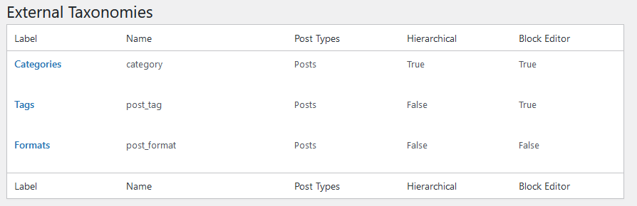
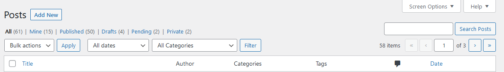
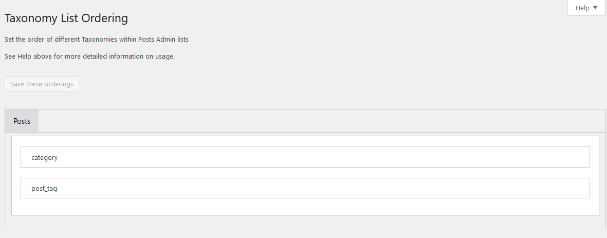
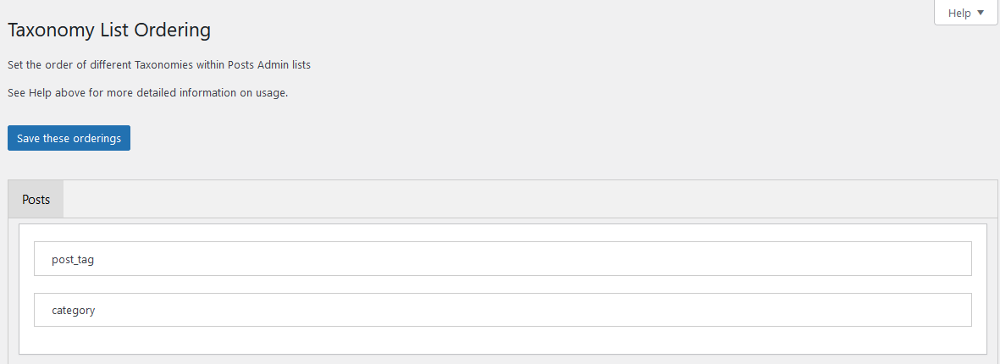
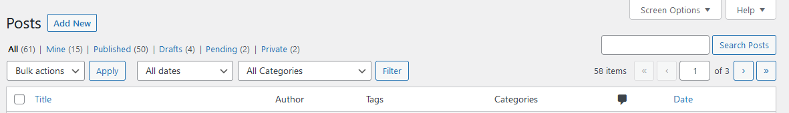
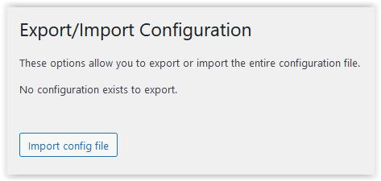

# Use of the Plugin

## Taxonomies Menu

When the plugin is activated, the functionality is available under a menu item *Taxonomies*

There are number of menu items within this group :

* All Taxonomies - Gives a list of all taxomonies managed (actually or potentially) by the plugin.

* Add Taxonomy - Allows a new taxonomy to be defined

* Terms Migrate - Allows terms defined in one taxonomy to be extracted and made available for importing into another.

* Terms Import - Enables terms to be bulk loaded onto another.

* Terms Merge - Enables several terms within a taxonomy to be merged together with their usages.

* Taxonomy List Order - If a post type can have several taxonomies, these are displayed in the order that they were defined.

This tool allows the order to be defined by the user.

* Configuration Export/Import - Allows the entire set of configuration data to be exported or imported.

Once a taxonomy has been defined using this plugin an additional option will be displayed.

* Rename Taxonomy Slug - Allows the Taxonomy slug and all associated terms to be changed.

## All Taxonomies

The *All Taxonomies* screen has two sections :
 
* Custom Taxonomies

This gives a list of previously entered Custom Taxonomies which is empty when first used.

Click on the *Add New* button or *Add Taxonomy* menu item to add a Taxonomy.

The taxonomy label name will be used to identify the taxonomy used in the plugin screens except for the List order screen where the slug name is used.

A number of significant properties of each taxonomy is shown in this list.

Once there are some taxonomies, the list will be populated.

* External Taxonomies

This gives a list of taxonomies available to the installation that has not been created by this plugin.

It is possible to add the additional functions provided by the plugin to these taxonomies.

Again a number of significant properties of each taxonomy is shown in this list.

## Custom Taxonomies Functions

Once a custom taxonomy has been defined some functional options will appear in the space under each taxonomy label when the pointer is over the area.

| Option | Processing |
| ---------------- | ----------------------------------------- |
|Modify          | Modify data - in a new panel [Add/Modify Taxonomy](./addmod.md)
|Export PHP      | Creates a download file containing the parameters |
|Delete          | Delete the parameter entries; leaves the term data |
|Flush & Delete  | Deletes the parameter entries and the term data |

See the [example page](./example.md) for an example download file.

See [Add/Modify Taxonomy](./addmod.md) for further information of the process.

## Tools

When the plugin is activated and a taxonomy has been registered, three tools are available in the administration menu under *Tools*. They are *Terms migrate*, *Terms import* and *Rename Taxonomy Slug*.

### Terms Migrate

This tool enables the existing terms held against a taxonomy to be copied to another within the database.

The user selects the Source and Destination taxonomies - which may be standard (built-in) or custom ones.

Once selected the entire set of terms held in the Source taxonomy are extracted from the database and entered into the screen ready for loading with the [Terms Import](./TermsImp.md) function.

This gives the opportunity to edit this list to choose subsets, etc.

No usages of these terms are migrated.

If both of these are Hierarchical, then the terms will be output in a format to be loaded as a hierarchy, otherwise a simple list will be produced.

See [example page](./example.md) to see a worked example of its usage.

Whilst it is called migrate, only copy has been implemented at this time. The standard terms deletion functionality WordPress can be used if required.

### Terms Import

This tool allows terms to be entered in bulk into a selected taxonomy.

The user selects the Taxonomy and also whether the data to be entered as non-hierarchical, hierarchical with leading spaces or tabs.  

For the hierarchical data entry, the number of spaces or tabs denote the hierarchy. Clearly the number of leading spaces or tabs can only br one greater than the immediately preceding line. 

Finally there is a text area where the terms are entered.

The terms are entered one per line. For hierarchical taxonomies it may be necessary to  enter existing terms in order to give the correct context for a sub-term to be entered. Existing term will not be updated.

As only term text is entered, the slug is generated from the term text and no description is created.

This data can be entered or amended in the appropriate Taxonomy maintenance screen. 

See the [example page](./example.md) for a specific example of the function usage.

### Terms Merge

This tool merges one or more terms of a taxonomy into a single term. All uses of the deleted term(s) will be migrated to the merge term.

It operates in five phases:

- Select the taxonomy whose terms you wish to merge.

- All terms of the taxonomy will be displayed for you to select the Destination term.

- Then you select one or more Source terms to be merged into the Destination term and deleted.

- The options selected are displayed for you to confirm the processing to be carried out, with all posts using the Source Term(s) will be linked to the Destination term and the Source Term(s) will be deleted.

- Once processed, the results of the processing are presented and standard WordPress caches are cleared.

### Taxonomy List Order

As delivered, Posts support both Categories and Tags (with slugs `categories` and `post-tags` respectively.

Since `categories` were defined before `post-tags`, the Posts Admin List (*All Posts*) has them in this order:

Using this tool will display

 
Dragging the first field below the second will give:

Once saved, the *All Posts* screen will display the ordering:

### Rename Taxonomy Slug

This tool allows the slug for a custom taxonomy to be renamed.

It also gives the option to change the query_var and rewrite slug (if that function is active).

As part of the update all its terms and their usages will be updated to remain in the taxonomy.

See the [example page](./example.md) for a specific example of the function usage.

### Configuration Export/Import

This tool allows the entire Custom Taxonomy definitions to be exported and/or imported to the browser.
The data is held in JSON format and is incompatible with data stored by the original plugin [Simple Taxonomy](https://github.com/herewithme/simple-taxonomy/)

When the plugin is first loaded, there is no configuration to export. But it is possible to load a configuration from another installation.

Once some configuration data has been created, both export and import options become available. 

